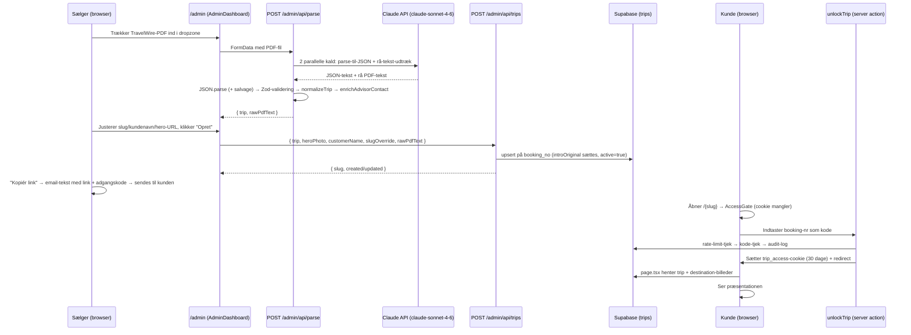

# SYSTEM-ARKITEKTUR — Unique Travel Rejsepræsentation

> **Dokumentversion:** 2026-07-20 (rev. 2 — efter sec-batch, password-flow og destinations-upload-flowet)
> **Beskriver produktion:** `origin/main` pr. 2026-07-20 (`234d2e8` + destinations-admin-batchen)
> **Verifikationsmetode:** Alle påstande i dette dokument er verificeret direkte i koden på `origin/main` og i den levende Supabase-database (`iunixfpthdftmkgpugex`) den 2026-07-20. Kode-referencer angives som `filsti:linjenummer`. Hvor noget ikke kunne verificeres, står der eksplicit "ukendt — kræver Ricko-bekræftelse".

---

## Indhold

1. [Executive summary](#1-executive-summary)
2. [Tech stack](#2-tech-stack)
3. [Repository-struktur](#3-repository-struktur)
4. [Dataflow ende-til-ende](#4-dataflow-ende-til-ende)
5. [Route-katalog](#5-route-katalog)
6. [React-komponent-katalog](#6-react-komponent-katalog)
7. [Admin-sider](#7-admin-sider)
8. [Database-model](#8-database-model)
9. [Zod-schemas](#9-zod-schemas)
10. [Auth-flow](#10-auth-flow)
11. [Claude-integration](#11-claude-integration)
12. [Rate-limiting](#12-rate-limiting)
13. [Audit-logging](#13-audit-logging)
14. [Brand-tokens](#14-brand-tokens)
15. [Deploy-flow](#15-deploy-flow)
16. [Kendte styrker](#16-kendte-styrker)
17. [Kendte begrænsninger](#17-kendte-begrænsninger)

Bilag: [A — Rekonstrueret DDL for hele databasen](#bilag-a--rekonstrueret-ddl-for-hele-databasen) · [B — Kode-uddrag af de centrale mekanismer](#bilag-b--kode-uddrag-af-de-centrale-mekanismer) · [C — globals.css: token-blok og klasse-indeks](#bilag-c--globalscss-token-blok-og-klasse-indeks) · [D — Hurtig-reference for nye udviklere](#bilag-d--hurtig-reference-for-nye-udviklere)

---

## 1. Executive summary

Unique Travel Rejsepræsentation er en intern Next.js 14-webapp der konverterer TravelWire PDF-rejseplaner til kunde-vendte online-præsentationer med unikke, kode-låste links. Den erstatter den gamle arbejdsgang hvor sælgere sendte statiske PDF'er til kunderne på mail.

**Brugerne** er Unique Travels sælgere (7 profiler i databasen pr. 2026-07-20). En sælger logger ind på `/admin` med individuel Supabase Auth-email/-adgangskode, trækker en TravelWire-PDF ind i en dropzone, og Claude (`claude-sonnet-4-6`) parser PDF'en til struktureret JSON på 20-40 sekunder. Sælgeren får et unikt link (`/{slug}`, typisk booking-nummeret) plus en færdig email-tekst med adgangskode, som sendes til kunden.

**Kunden** åbner linket, indtaster booking-nummeret som adgangskode (beskyttet af rate-limit: 10 forsøg pr. 15 min pr. IP), og ser en brandet præsentation: hero-billede, dag-for-dag-rejseplan med udvidelige kort, hoteller, pris og en kontakt-CTA der linker direkte til den sælger der lavede rejsen.

**Live i produktion lige nu** (35 rejser i databasen): PDF-upload → Claude-parsing → kundeside, individuelle sælger-logins (cutover fra delt adgangskode 2026-06-02), sælger-profiler med advisor-matching til CTA, fælles destinationsbillede-bibliotek (13 destinationer), QA-side til PDF-vs-JSON-sammenligning, redigerbar intro-tekst med audit-log og "Gendan AI-tekst", rate-limiting på kunde-unlock, audit-logging (24 hændelser logget), soft delete og smart destination-routing (ren Zanzibar-rejse fanges fra "Tanzania").

**Hosting:** Vercel (auto-deploy ved push til `main`), Supabase-projekt `iunixfpthdftmkgpugex` (Postgres 17, eu-west-1) til data, auth og billede-storage. Repoet `ricko-spec/unique-travel-rejsepraesentation` er **public** — ingen secrets eller kundedata ligger i det.

---

## 2. Tech stack

Alle versioner er verificeret i `package.json` på `main`:

| Teknologi | Version (package.json) | Rolle | Hvorfor |
|---|---|---|---|
| Next.js | `^14.2.35` | Framework (App Router) | Server Components + server actions + API-routes i én deploybar enhed; Vercel-native |
| React / React DOM | `^18.3.1` | UI | Følger Next 14 |
| TypeScript | `^5.6.3` (dev) | Typesikkerhed | — |
| `@anthropic-ai/sdk` | `^0.98.0` | Claude-kald (PDF-parsing) | Native PDF-support via `document`-content-block — ingen egen PDF-tekstudtrækning nødvendig |
| `@supabase/supabase-js` | `^2.46.1` | Data-adgang (service role, server-side) | Al data-adgang går gennem serveren; RLS lukker alt andet |
| `@supabase/ssr` | `^0.5.2` | Cookie-baseret auth-session | Standardmåden at holde Supabase Auth-sessioner i Next.js App Router (middleware + server components) |
| Zod | `^3.23.8` | Runtime-validering af Claude-output og request-bodies | Claude-output er utroværdigt input; Zod-skemaet er "loose" med preprocessors så små format-afvigelser ikke vælter parsing (se §9) |
| sharp | `^0.35.3` | Server-side billedbehandling (resize + WebP) i destinations-upload | Originaler (op til 50 MB) resizes til 1920×1080/1200×800 WebP i `finalize-upload` — klient-side resize blev fravalgt pga. kvalitet (tilføjet 2026-07-20) |
| Tailwind CSS | `^3.4.15` (dev) | Utility-CSS (primært admin/nyere komponenter) | Suppleret af håndskrevne klasser i `globals.css` for kundesiden — designet var en pixel-perfekt HTML-reference (`reference/`) der var lettest at portere som ren CSS |
| `next/font/google` (Cormorant + Open Sans) | (indbygget i Next) | Self-hostede brand-fonte | GDPR — ingen requests til Google Fonts fra kundens browser (`src/app/layout.tsx:2-18`) |
| ESLint + eslint-config-next | `^8.57.1` / `14.2.18` (dev) | Lint | — |
| autoprefixer + postcss | `^10.4.20` / `^8.4.49` (dev) | CSS-pipeline | — |

**Scripts** (`package.json:5-11`): `dev`, `build`, `start`, `lint`, `typecheck` (`tsc --noEmit`).

**Bemærk — model-versionen:** README.md:45 og ældre projektbeskrivelser siger `claude-sonnet-4-20250514`, men koden bruger **`claude-sonnet-4-6`** (`src/lib/claude.ts:3`, ændret i commit `975b053`, 2026-05-26). Koden er sandheden; README er forældet på dette punkt.

**Ikke i stacken** (bevidst): ingen ORM (rå supabase-js-kald), ingen client-side Supabase-dataadgang (kun auth-cookies), ingen state-management-bibliotek (lokal React-state rækker), ingen testing-framework (se §17).

---

## 3. Repository-struktur

Verificeret med `git ls-files` på `origin/main`. **Bemærk:** der findes **ingen** `docs/`- eller `public/`-mappe i produktion (denne fil opretter `docs/`). Statisk-asset-mappen `public/` er aldrig oprettet — alle billeder hentes fra Supabase Storage eller eksterne URLs.

```
uniquetravel-rejsepraesentation/
├── .env.example                  # Skabelon for de 4 påkrævede miljøvariabler (ingen values)
├── next.config.mjs               # reactStrictMode, alle https-billedhosts tilladt, serverActions bodySizeLimit 10mb
├── tailwind.config.ts            # Brand-farver + font-familier som Tailwind-tokens (spejler globals.css)
├── package.json                  # Dependencies og scripts (se §2)
├── README.md                     # Setup-guide (delvist forældet: model-navn og struktur-afsnit mangler nyere filer)
│
├── reference/                    # Design-handoff — IKKE produktionskode
│   ├── README.md                 # Komplet designspecifikation: tokens, sektioner, interaktioner, responsive-tabel
│   ├── Rejsepræsentation.html    # Fungerende HTML-prototype med al CSS inline
│   └── app.jsx                   # React-referencetræ med eksempeldata (UMD React 18)
│
├── scripts/
│   ├── backfill-advisor-contacts.mjs   # Engangs-script: sætter advisorEmail/Phone på eksisterende trips fra profiles (dry-run default, --apply for at skrive)
│   └── check-schema-drift.mjs    # Drift-tjek: diffner live-DB (via schema_snapshot RPC) mod supabase/schema-baseline.json — exit 1 ved drift
│
├── src/
│   ├── middleware.ts             # Holder Supabase-session-cookien frisk — matcher KUN /admin og /admin/*
│   │
│   ├── app/
│   │   ├── layout.tsx            # Root-layout: fonte (Cormorant + Open Sans via next/font), lang="da", global noindex
│   │   ├── page.tsx              # Forsiden er kun redirect("/admin") — der findes ingen offentlig forside
│   │   ├── globals.css           # ALLE brand-tokens og komponent-stilarter (1346 linjer) — kundesiden er håndskrevet CSS, ikke Tailwind
│   │   │
│   │   ├── [bookingId]/          # KUNDENS side — én dynamisk route pr. rejse-slug
│   │   │   ├── page.tsx          # Server Component: henter trip via slug, tjekker adgangs-cookie, renderer alle sektioner
│   │   │   ├── actions.ts        # Server action unlockTrip: rate-limit → kode-tjek → cookie → redirect (+ audit-log)
│   │   │   ├── AccessGate.tsx    # Client: adgangskode-formular (vises når cookie mangler)
│   │   │   ├── loading.tsx       # Skeleton-hero mens data hentes
│   │   │   └── not-found.tsx     # Brandet fejlside med telefonnummer
│   │   │
│   │   └── admin/                # SÆLGERENS univers — alt bag Supabase Auth
│   │       ├── page.tsx          # Session-gate: viser AdminLogin eller AdminDashboard
│   │       ├── AdminLogin.tsx    # Client: email+password-formular mod POST /admin/api/auth
│   │       ├── AdminDashboard.tsx# Client: PDF-dropzone, parse-preview, opret/opdater, liste over alle rejser
│   │       ├── DestinationManager.tsx  # Client: billede-bibliotek pr. destination — opret destination + 3-trins signed-URL-upload (hero + 3 galleri-slots)
│   │       │
│   │       ├── trips/[id]/       # Detalje-side pr. rejse
│   │       │   ├── page.tsx      # Server: henter row, gater på session
│   │       │   └── TripDetail.tsx# Client: kundelink+kode, intro-editor med brand-advarsler og "Gendan AI-tekst"
│   │       │
│   │       ├── qa/[slug]/
│   │       │   └── page.tsx      # QA-side: rå PDF-tekst side-om-side med parsed JSON
│   │       ├── qa/_placeholder.md# Tom placeholder fra mappens oprettelse (død fil)
│   │       │
│   │       ├── profil/
│   │       │   ├── page.tsx      # Server: gater + henter egen profil
│   │       │   └── ProfileEditor.tsx  # Client: rediger navn/telefon/advisor_match_name + skift adgangskode (kræver nuværende)
│   │       │
│   │       └── api/              # Alle API-routes (se §5)
│   │           ├── auth/route.ts             # POST login (rate-limit + audit) / DELETE logout
│   │           ├── password/route.ts         # PATCH skift adgangskode (nuværende kode kræves, rate-limit, audit)
│   │           ├── parse/route.ts            # POST PDF → Claude → valideret Trip-JSON
│   │           ├── trips/route.ts            # GET liste / POST upsert
│   │           ├── trips/[id]/route.ts       # PATCH active/heroPhoto
│   │           ├── trips/[id]/intro/route.ts # POST intro-redigering (fingerprints-audit, optimistisk lås → 409)
│   │           ├── destinations/route.ts     # GET bibliotek / POST opret destination
│   │           ├── destinations/upload-url/route.ts      # POST signeret _staging-URL (trin 1)
│   │           ├── destinations/finalize-upload/route.ts # POST download+sharp→WebP+række-upsert (trin 3)
│   │           ├── profile/route.ts          # GET/PATCH egen profil
│   │           └── health/route.ts           # GET env-diagnostik + Supabase-probe
│   │
│   ├── components/trip/          # Kundesidens sektioner, i sidens rækkefølge
│   │   ├── Hero.tsx              # Fuldskærms-hero: foto, destination, pills, intro, CTA
│   │   ├── TripDetails.tsx       # Mørk metadata-stribe: afrejse/hjemkomst/rejsende/rådgiver
│   │   ├── Timeline.tsx          # Dag-for-dag-rejseplan med farvekodede, udvidelige kort
│   │   ├── DestinationGallery.tsx# Op til 3 destinationsbilleder fra det fælles bibliotek
│   │   ├── Hotels.tsx            # Hotel-kort inkl. pakke-rejser, værelsesfordeling, alternativ-hotel
│   │   ├── PriceAndNote.tsx      # Pris-sektion + "God at vide"-note
│   │   ├── ContactCTA.tsx        # Guld-CTA med mailto/tel til den matchede sælger
│   │   ├── Footer.tsx            # Wordmark + tagline
│   │   ├── ActionBar.tsx         # Mobil sticky bund-bar: Ring / Kontakt os
│   │   └── SectionHeader.tsx     # Genbrugt sektions-overskrift (guld-label + hairline)
│   │
│   └── lib/
│       ├── audit.ts              # Central writeAudit-helper (best-effort) + typed AuditAction-union + requestMeta
│       ├── claude.ts             # Anthropic-klient, SYSTEM_PROMPT, JSON-salvage, rå-tekst-udtræk
│       ├── types.ts              # Zod-schemas, Trip-typer, normalizeTrip, danske dato-helpers (537 linjer)
│       ├── profiles.ts           # Profil-CRUD (RLS self-only) + enrichAdvisorContact (service role)
│       ├── rate-limit.ts         # checkRateLimit → increment_rate_limit RPC (fail-open)
│       └── supabase/
│           ├── server.ts         # Service-role-klient + nøgle-validering + env-diagnostik
│           └── auth.ts           # Session-klient (@supabase/ssr) + getSessionUser
│
└── supabase/                     # Nummererede, idempotente migrationer (001-007) — hele DB-skemaet
    ├── README.md                 # Kør-rækkefølge, regler og drift-tjek
    ├── 001_trips.sql             # trips + RLS + set_updated_at-helper
    ├── 002_profiles.sql          # profiles + RLS + handle_new_user-trigger
    ├── 003_destinations.sql      # destinations (billedbibliotek) + public-read RLS
    ├── 004_audit_log.sql         # audit_log + indexes + RLS
    ├── 005_rate_limits.sql       # rate_limits + increment_rate_limit RPC
    ├── 006_created_by_on_trips.sql  # trips.created_by (sporing; skrives ikke af koden endnu)
    ├── 007_parse_failures.sql    # parse_failures dead-letter (ikke koblet til koden endnu)
    ├── 008_schema_snapshot.sql   # schema_snapshot() RPC — leverer DDL-metadata til drift-tjekket
    └── schema-baseline.json      # Committet snapshot af live-DDL (opdateres med --update-baseline)
```

**Om `supabase/`-mappen:** Frem til 2026-07-20 indeholdt den kun `trips` og `profiles` (som `schema.sql`/`profiles.sql`), mens `destinations`, `audit_log`, `rate_limits`, `parse_failures` og `increment_rate_limit` kun fandtes i den levende database. Det er nu rettet: hele skemaet er versioneret som migrationerne 001-007, verificeret 1:1 mod live-DDL. Se `supabase/README.md` for reglerne der skal forhindre ny drift.

---

## 4. Dataflow ende-til-ende

Fra sælger uploader PDF til kunde ser præsentationen. Filerne i hvert trin er verificeret.



### Trin for trin

**1. Upload og parsing (sælger)**
- Sælgeren trækker en PDF ind i dropzonen på `/admin` (`src/app/admin/AdminDashboard.tsx:216-244`). Kun `.pdf`-filnavne accepteres client-side (`AdminDashboard.tsx:95`).
- `handleParse` (`AdminDashboard.tsx:66-91`) POSTer filen som FormData til `/admin/api/parse`.
- Parse-routen (`src/app/admin/api/parse/route.ts`) kræver session (`:12`), afviser filer > 10 MB (`:21`), base64-koder PDF'en (`:26`) og kører **to Claude-kald i parallel** (`:31-34`): `parsePdfWithClaude` (struktureret JSON) og `extractPdfRawText` (rå tekst til QA-siden — fejl her sluges med `.catch(() => "")`).
- Claude-svaret JSON-parses med twostrenget salvage-strategi (`src/lib/claude.ts:100-125`, se §11).
- Resultatet valideres mod `tripSchema` (`parse/route.ts:48`). Ved skema-fejl returneres 422 med de første 6 Zod-issues + det rå objekt, så sælgeren kan se hvad der gik galt.
- `normalizeTrip` (`src/lib/types.ts:515-536`) mapper legacy-feltnavne, beregner manglende dato-labels og omklassificerer ren Zanzibar (se §9).
- `enrichAdvisorContact` (`src/lib/profiles.ts:76-112`) slår `trip.advisor` op i `profiles.advisor_match_name` (case-insensitivt, service role) og kopierer sælgerens email/telefon ind på trip'en. Intet match → `null` + warning i loggen.

**2. Preview og oprettelse (sælger)**
- Dashboardet viser et resumé (destination, datoer, antal elementer) plus råt JSON i en `<details>` (`AdminDashboard.tsx:257-352`). Kundenavn prefilles fra `travellers`, slug prefilles fra `bookingNo` (`AdminDashboard.tsx:89-90`).
- Findes booking-nummeret allerede i listen, vises en gul advarsel om at den eksisterende præsentation opdateres og linket genbruges (`AdminDashboard.tsx:258-267`).
- "Opret/Opdater" POSTer til `/admin/api/trips` (`src/app/admin/api/trips/route.ts:63-200`):
  - Slug = `slugOverride` eller slugified booking-nr/destination (`:78`).
  - Pre-check på `booking_no` afgør create vs update (`:88-102`).
  - Slug-kollision med en **anden** booking giver 409 med forklarende besked i stedet for rå Postgres-fejl 23505 (`:107-125`).
  - Upsert på `onConflict: "booking_no"` (`:135-153`). `introOriginal` sættes til den friske AI-intro hvis den ikke findes (`:145`) — fundamentet for "Gendan AI-tekst". `active` sættes altid `true` — re-upload genaktiverer en soft-deleted rejse (`:150`).
- Sælgeren får link-boksen og kan kopiere en færdig dansk email-tekst med link + adgangskode (`AdminDashboard.tsx:152-168`).

**3. Kunde åbner linket**
- `/{slug}` rammer `src/app/[bookingId]/page.tsx` (`force-dynamic`, `revalidate 0`, `:17-18`).
- `loadTrip` henter rækken via `slug` + `active=true` med service role (`:20-34`). Findes den ikke → `not-found.tsx`.
- Cookie-tjek: `trip_access_{slug}` skal indeholde booking-nummeret (`:67-69`). Ellers renderes `AccessGate`.
- `AccessGate` (`src/app/[bookingId]/AccessGate.tsx`) kalder server-actionen `unlockTrip` (`src/app/[bookingId]/actions.ts:43-121`):
  1. Rate-limit-tjek FØR kodetjek: `unlock:{ip}:{slug}`, 10 forsøg/15 min (se §12).
  2. Ved for mange forsøg: audit-event `unlock_rate_limited` + dansk fejlbesked med ventetid.
  3. Kode sammenlignes med `booking_no`. Forkert → `unlock_failed`-audit + fejlbesked.
  4. Korrekt → `unlock_success`-audit, httpOnly-cookie scoped til `/{slug}` med 30 dages levetid (`actions.ts:112-118`), derefter `redirect`.
- Med gyldig cookie renderer `page.tsx` hele præsentationen: data Zod-valideres igen (`:74`) og normaliseres (`:93`) ved **hver** visning — gamle rækker med legacy-JSON-form renderes korrekt uden re-parse. Hero-billedet vælges som `trips.hero_photo` → ellers destinationens `hero_url` → ellers CSS-gradient (`page.tsx:97`).

**4. Løbende redigering (sælger)**
- Intro-teksten kan redigeres på `/admin/trips/[id]` og gemmes via `POST /admin/api/trips/[id]/intro`, der skriver `intro`, `introEditedAt`, `introEditedBy` ind i `data`-jsonb og audit-logger before/after (se §7 og §13).
- Destinationsbilleder uploades i DestinationManager → Supabase Storage-bucket `destinations` → public URL gemmes i `destinations`-tabellen (se §5). Alle rejser til samme destination deler billederne automatisk.

---

## 5. Route-katalog

Verificeret ved gennemlæsning af samtlige 11 `route.ts`-filer under `src/app/` (der findes ingen andre). Alle routes kører `runtime = "nodejs"` og `dynamic = "force-dynamic"`. "Auth" betyder `getSessionUser()`-tjek der returnerer 401 uden gyldig Supabase-session-cookie.

| Sti | Metode | Auth | Formål | Input | Output |
|---|---|---|---|---|---|
| `/admin/api/auth` | POST | Nej (er selve login) | Log ind via Supabase Auth. Rate-limitet `login:{ip}` (10/15 min) + audit `login_success`/`login_failed`/`login_rate_limited` (SEC-2) | JSON `{ email, password }` | `{ ok: true }` / 400 / 401 / 429 `{ error }` — session sættes som cookies |
| `/admin/api/auth` | DELETE | Nej (no-op uden session) | Log ud (signOut + cookie-rydning) | — | `{ ok: true }` |
| `/admin/api/password` | PATCH | Ja | Skift egen adgangskode. Kræver nuværende kode (verificeret via session-løs anon-klient), rate-limitet `pwchange:{ip}`, audit `password_changed`/`password_change_failed`/`password_change_rate_limited` | JSON `{ currentPassword, password (min 6) }` | `{ ok: true }` / 400 / 401 / 429 |
| `/admin/api/parse` | POST | Ja | PDF → Claude → valideret, normaliseret, advisor-beriget Trip | FormData `file` (PDF, max 10 MB) | `{ trip, rawPdfText }` / 400 / 422 `{ error, issues, raw }` / 500 |
| `/admin/api/trips` | GET | Ja | Liste over alle rejser (inkl. `data` + `raw_pdf_text` til QA) | — | `{ trips: [...] }` nyeste først |
| `/admin/api/trips` | POST | Ja | Opret/opdater præsentation (upsert på `booking_no`) | JSON `{ trip, heroPhoto?, customerName?, slugOverride?, rawPdfText? }` | `{ id, slug, created, updated }` / 400 / 409 (slug-kollision) / 500 |
| `/admin/api/trips/[id]` | PATCH | Ja | Aktivér/deaktivér (soft delete) og/eller skift hero-foto | JSON `{ active?, heroPhoto? }` | `{ ok: true }` / 400 / 500 |
| `/admin/api/trips/[id]/intro` | POST | Ja | Gem sælger-redigeret intro (max 500 tegn; tom tilladt) + audit med fingerprints. **Optimistisk lås (DATA-1):** UPDATE betinget på læst `updated_at` — konflikt giver 409 | JSON `{ intro }` | `{ ok: true, trip }` / 400 / 404 / **409** / 500 |
| `/admin/api/destinations` | GET | Ja | Hent destinationsbibliotek | — | `{ destinations: [{ name, hero_url, gallery, updated_at }] }` |
| `/admin/api/destinations` | POST | Ja | **Opret** ny destination (tomme billedfelter). Case-insensitivt dublet-tjek. Billed-URLs skrives kun af `finalize-upload` | JSON `{ name }` | `{ destination }` / 400 / 409 (dublet) / 500 |
| `/admin/api/destinations/upload-url` | POST | Ja | Trin 1 af billed-upload: udsted signeret Storage-URL til `_staging/{dest}/{slot}-{ts}-{random}.tmp` + opportunistisk oprydning af staging-filer > 24 t | JSON `{ destination, slot }` | `{ signedUrl, token, path }` / 400 / 500 |
| `/admin/api/destinations/finalize-upload` | POST | Ja | Trin 3: download fra staging (sti strengt regex- og destinations-valideret), magic-byte-tjek, sharp → WebP (hero 1920×1080 q85 / galleri 1200×800 q80), staging slettes, destinations-rækken upsertes, audit. `maxDuration = 60` | JSON `{ destination, slot, stagingPath }` | `{ url }` / 400 / 500 |
| `/admin/api/profile` | GET | Ja (implicit via RLS) | Hent egen profil | — | `{ profile }` / 401 |
| `/admin/api/profile` | PATCH | Ja (implicit via RLS) | Opdater egne felter | JSON `{ full_name?, phone?, advisor_match_name? }` | `{ profile }` / 400 / 401 / 500 |
| `/admin/api/health` | GET | Ja | Driftsdiagnostik: env-sanity + Supabase-probe | — | `{ env, supabaseReachable, supabaseError, nodeVersion }` |

**Særlige noter:**
- `POST /admin/api/parse` har `maxDuration = 300` (`parse/route.ts:9`) — Claude-kaldet kan tage op mod et minut ved store PDF'er.
- Den gamle `POST /admin/api/destinations/upload` (FormData-baseret) blev **slettet 2026-07-20**: Vercel serverless afviser request-bodies > 4,5 MB ved platform-kanten, så originalfotos kan aldrig gå gennem en API-route. Billeder uploades nu direkte til Supabase Storage via det signerede 3-trins-flow (upload-url → PUT → finalize-upload). Bemærk at parse-routen stadig modtager PDF'er via FormData — TravelWire-PDF'er er små nok, men grænsen på 4,5 MB (ikke de kodede 10 MB) er den reelle.
- Ud over API-routes findes **én server action**: `unlockTrip(slug, code)` i `src/app/[bookingId]/actions.ts` — kundens kode-unlock. Den er ikke en HTTP-route men kaldes via Next.js' server-action-mekanisme fra `AccessGate`. Auth: ingen (kunden er anonym); beskyttet af rate-limit + audit i stedet.
- Fejl-responser fra `trips`-routes inkluderer `envDiagnostics()` ved forbindelsesfejl (`trips/route.ts:57`) — bevidst valg for at kunne fejlsøge Vercel-env-problemer direkte fra klienten. Diagnostikken indeholder ikke selve nøglerne, kun præsens/rolle/længde.

---

## 6. React-komponent-katalog

### Kunde-vendte komponenter (`src/components/trip/`, renderes i rækkefølge af `[bookingId]/page.tsx:95-109`)

**`Hero.tsx`** (client) — Det første kunden ser: fuldskærms-sektion med destinationsfoto, "Rejseforslag"-kicker, destinationsnavn i stor Cormorant, pills med undertitel + datointerval, AI-introteksten og en guld-CTA der scroller til kontakt-sektionen.
*Data:* `trip` (destination, subtitle, departure, return, intro) + `heroPhoto`-URL (prioriteret: rejse-specifikt foto → destinationens hero → gradient).
*States:* `photoOk` — hvis billedet fejler (`onError`), skjules `` så CSS-fallback-gradienten (`globals.css:83-91`) tager over. Tom `intro` skjuler afsnittet (`Hero.tsx:43`). Eksporterer også konstanten `ADVISOR_PHONE` (`:6,55`) — den bruges ikke af Hero selv og importeres ingen steder (død kode).

**`TripDetails.tsx`** (server) — Mørk grøn metadata-stribe under hero'en med fire felter: Afrejse, Hjemkomst, Rejsende, Rådgiver (+ booking-nr).
*Data:* `trip.departure/return` (formateres til dansk langform "torsdag 21. november 2025" via `formatLongDateDK`, `types.ts:307-313`), `travellers`, `advisor`, `bookingNo`.
*States:* Rejsende-strengen splittes i enkeltnavne på separate linjer; ved > 6 navne bruges 2 kolonner; antal-parentesen ("(6 voksne)") vises som summary-linje (`TripDetails.tsx:18-39`). Kan ikke parses navnelisten, vises strengen rå.

**`Timeline.tsx`** (client) — Rygsøjlen i præsentationen: lodret tidslinje med farvekodede prikker (fly = grøn, hotel = guld, transfer = lys teal, aktivitet = rust) og et hvidt kort pr. element med type-label, dato-label, titel, detaljer, chips og evt. OBS-callout.
*Data:* `trip.itinerary` (`ItineraryItem[]`).
*States:* Hvert kort har egen `open`-state for det udvidelige indhold. Toggle-teksten afhænger af `expandKind`: "Se flydetaljer" (flight), "Læs om udflugten" (program eller enkelt-aktivitet), "Se udflugtsmuligheder" (flere aktiviteter) (`Timeline.tsx:14-32`). Tre expand-renderere: `FlightContent` (label/value-liste, tom-state med "Ingen yderligere flydetaljer"), `ProgramContent` (dagsprogram + "Inkluderet"-liste + note om at fuld beskrivelse er i PDF'en i mailen), `ActivitiesContent` (titel + beskrivelse pr. udflugt).

**`DestinationGallery.tsx`** (server) — Op til 3 billeder fra det fælles destinationsbibliotek i et responsivt grid (1/2/3 kolonner efter antal).
*Data:* `destinations.gallery` (jsonb-array af URLs) for rejsens destination.
*States:* Renderer `null` hvis ingen billeder — sektionen forsvinder helt (`DestinationGallery.tsx:8`).

**`Hotels.tsx`** (server) — Ét kort pr. hotel: mørkt hoved med navn/lokation + nætter i stor guld-tal, krop med Værelse/Måltider/Check-in/Check-ud (danske langdatoer).
*Data:* `trip.hotels` (`Hotel[]`).
*States/varianter:* Værelsesfordeling-liste (`roomAllocations`), pakke-rejse-blok med sub-hoteller når `isPackage` (`Hotels.tsx:57-73`), "Inkluderet/Ikke inkluderet i prisen"-lister, kursiverede noter, samt "Dette resort kunne også være noget for jer"-blok for alternativ-hotellet inkl. besparelse (`:107-133`). Alle blokke er betingede — et simpelt hotel viser kun hovedet + de 4 felter.

**`PriceAndNote.tsx`** (server) — Grøn pris-sektion med "Samlet pakkerejsepris" i stor guld-Cormorant, pr.-person-linje og pris-note; derunder "God at vide"-boksen hvis `practicalNote` findes.
*Data:* `trip.price.{total, perPerson, note}`, `trip.practicalNote`.

**`ContactCTA.tsx`** (server) — Guld-kort "Spørgsmål til jeres rejse? Ring eller skriv direkte til {fornavn}". Hele kortet er ét `mailto:`-link med prefilled emne "Spørgsmål til rejse {bookingNo}"; derunder evt. en direkte `tel:`-linje.
*Data:* `trip.advisor`, `trip.advisorEmail`, `trip.advisorPhone` (sat af `enrichAdvisorContact`).
*States:* **Hele sektionen skjules** hvis `advisorEmail` er null (`ContactCTA.tsx:5`) — dvs. hvis sælgeren ikke har en profil med matchende `advisor_match_name`. Telefon-linjen skjules separat hvis `advisorPhone` mangler. Bemærk: hero'ens "Kontakt"-knapper linker til `#kontakt` — mangler CTA'en, peger de på et anker der ikke findes (siden scroller bare i bund).

**`Footer.tsx`** (server) — Statisk wordmark + "Skræddersyede rejser · København".

**`ActionBar.tsx`** (server) — Mobil-only sticky bund-bar (< 760px, skjult ved print) med "Ring" (hardkodet `tel:+4559498630` — hovednummeret, ikke sælgerens) og "Kontakt os" (`#kontakt`).

**`SectionHeader.tsx`** (server) — Genbrugt overskrift: guld-versal-label + hairline. Bruges af Timeline ("Rejseplan"), Hotels ("Jeres hoteller") og PriceAndNote ("Pris").

### Admin-komponenter (ligger under `src/app/admin/`, ikke `src/components/`)

`AdminLogin`, `AdminDashboard`, `DestinationManager`, `TripDetail`, `ProfileEditor` — beskrevet funktionelt i §7. Dertil `AccessGate` på kundesiden (§4 trin 3).

---

## 7. Admin-sider

Der findes **4 admin-sider** i produktion: `/admin`, `/admin/trips/[id]`, `/admin/qa/[slug]`, `/admin/profil`. **Bemærk:** en separat `/admin/upload`-side findes ikke — PDF-upload er en sektion på selve `/admin`-dashboardet. Alle sider er `force-dynamic`, `noindex`, og gater på `getSessionUser()`.

### `/admin` — Dashboard (`page.tsx` + `AdminDashboard.tsx` + `DestinationManager.tsx`)

Uden session vises `AdminLogin` i stedet (ingen redirect — samme URL, `page.tsx:13-18`).

Sælgeren kan:
1. **Uploade og parse en PDF** — dropzone (klik eller drag-and-drop), spinner med forventningstekst "20-40 sekunder". *API:* `POST /admin/api/parse`.
2. **Oprette/opdatere en præsentation** — justere link-slug, kundenavn (internt) og hero-foto-URL med live-preview; se råt JSON; advarsel hvis booking-nummeret findes i forvejen. *API:* `POST /admin/api/trips`.
3. **Kopiere kunde-materiale** — "Kopiér link" lægger en færdig dansk email-tekst (intro-linje + link + "Adgangskode: {booking_no}") i udklipsholderen (`AdminDashboard.tsx:152-168`).
4. **Administrere alle præsentationer** — tabel med booking, destination, kunde, dato, status; pr. række: Kopiér link, Åbn, Detaljer (→ `/admin/trips/[id]`), Sammenlign (→ `/admin/qa/[slug]`), Deaktivér/Aktivér. *API:* `GET /admin/api/trips`, `PATCH /admin/api/trips/[id]`.
5. **Vedligeholde destinationsbilleder** — `DestinationManager` nederst: **opret ny destination** (navn, trimmet, case-insensitivt dublet-tjek i både klient og server) og pr. destination ét hero-slot (16:9) + tre galleri-slots (4:3). Upload kører 3-trins-flowet: lokal validering (max 50 MB + magic-byte-sniff) → `POST .../upload-url` (signeret Storage-URL) → direkte PUT til Supabase Storage (udenom Vercels 4,5 MB-grænse) → `POST .../finalize-upload` (sharp → WebP, række-opdatering, staging-oprydning). "Behandler billede..." vises under hele forløbet. *API:* `GET/POST /admin/api/destinations`, `POST .../upload-url`, `POST .../finalize-upload`.
6. **Log ud** (`DELETE /admin/api/auth`) og gå til **Min profil**.

### `/admin/trips/[id]` — Rejse-detaljer (`page.tsx` + `TripDetail.tsx`, tilføjet 2026-06-17)

Sælgeren kan:
1. **Kopiere kundelink og se adgangskoden** (booking-nr).
2. **Redigere intro-teksten** — textarea med 500-tegns-tæller, brand-regel-boks (JA: områder/rute/natur/stemning · NEJ: kundenavn/hotelnavne/værelsestyper/måltidsplaner/nat-tal) og **bløde advarsler** beregnet client-side mod rejsens egne data: hotelnavne (inkl. sub-hoteller), kundenavne-tokens fra `travellers`, dag/nat-tal, måltidsplaner (`TripDetail.tsx:16-68`). Advarsler blokerer aldrig gem — kun >500 tegn gør.
3. **Gendanne AI-teksten** — knappen sætter textarea'en til `introOriginal`; deaktiveret med forklarende tooltip for rejser oprettet før featuren (`TripDetail.tsx:212-223`).
4. Se **"Sidst redigeret af {email} · {tidspunkt}"** fra `introEditedBy/At`.
*API:* `POST /admin/api/trips/[id]/intro` (auth + audit + max 500 tegn — serveren er den hårde grænse, klienten kun UX).

### `/admin/qa/[slug]` — Sammenligning (`qa/[slug]/page.tsx`, tilføjet 2026-05-27)

To-kolonne-visning: venstre den rå PDF-tekst (`trips.raw_pdf_text`, udtrukket af Claude ved parse), højre den parsede JSON (`trips.data`). Formål: opdage parsing-tab — "hvis noget mangler i højre kolonne men findes i venstre, skal Claude-prompten justeres" (sidens egen hjælpetekst). Rejser uploadet før featuren viser en forklarende placeholder. Ingen API-kald — ren server-side læsning.

### `/admin/profil` — Min profil (`profil/page.tsx` + `ProfileEditor.tsx`, tilføjet 2026-06-02)

Sælgeren kan redigere **fulde navn**, **telefon** og **rådgivernavn i rejseplaner** (`advisor_match_name`) — sidstnævnte skal matche navnet i TravelWire-PDF'ernes "Vores ref:"-linje præcist, da det styrer om kundens ContactCTA viser sælgerens email/telefon. Email er read-only (login-identitet). *API:* `GET/PATCH /admin/api/profile` (RLS: kun egen række). Siden har desuden en **"Skift adgangskode"-sektion** (tilføjet `ba1b5e1`, 2026-07-20): nuværende adgangskode kræves, ny kode min. 6 tegn + bekræftelse, client-validering før kald. *API:* `PATCH /admin/api/password` (se §5 — verifikation via session-løs anon-klient, rate-limit `pwchange:{ip}`, fuld audit).

---

## 8. Database-model

Verificeret direkte i den levende database 2026-07-20 (`list_tables` + `pg_policies` + `pg_indexes` + `pg_get_functiondef` på projekt `iunixfpthdftmkgpugex`). **6 tabeller**, alle med RLS aktiveret.

> **Vigtigt om projekt-referencer:** `.env.example:2` og README peger på `iunixfpthdftmkgpugex` — det er dér de 35 rejser, 7 profiler og al audit-data ligger, altså **den faktiske produktionsdatabase**. To andre refs optræder i repoet og er **misvisende**: `supabase/schema.sql:2` nævner `ocxrvkrggzppyhgyambj` (det er Allotment-værktøjets projekt — copy-paste-fejl), og `supabase/profiles.sql:2-3` kalder `iunixfpthdftmkgpugex` for "dev" og nævner `sujimigwcjkzpekkdpzf` som "production" — om dét projekt overhovedet findes/bruges er ukendt — kræver Ricko-bekræftelse.

> **Schema-drift (løst 2026-07-20):** Oprindeligt havde kun `trips` og `profiles` DDL i repoet, mens `destinations`, `audit_log`, `rate_limits`, `parse_failures` og `increment_rate_limit` var oprettet direkte i Supabase uden versionering. Hele skemaet er nu versioneret som `supabase/001-007_*.sql`, verificeret mod live-DDL. Dokumentationen nedenfor beskriver den levende database; migrationsfilerne er den kørbar kilde.

### `trips` — hovedtabellen (35 rækker; oprindelig, i `supabase/schema.sql`)

| Kolonne | Type | Constraints/default | Betydning |
|---|---|---|---|
| `id` | uuid | PK, `gen_random_uuid()` | — |
| `booking_no` | text | NOT NULL, **UNIQUE** | TravelWire-booking-nr; upsert-nøgle OG kundens adgangskode |
| `slug` | text | NOT NULL, **UNIQUE**, default `lower(encode(gen_random_bytes(6),'hex'))` | URL-stien `/{slug}`. DB-defaulten (tilfældig hex, commit `94ef4cd`) bruges reelt aldrig — koden sender altid en slug |
| `destination` | text | NOT NULL | Denormaliseret fra `data` til liste-visning og destination-opslag |
| `customer_name` | text | NULL | Internt kundenavn (vises kun i admin) |
| `data` | jsonb | NOT NULL | **Hele Trip-strukturen** inkl. `intro`, `introOriginal`, `introEditedAt/By`, `advisorEmail/Phone` (se §9) |
| `hero_photo` | text | NULL | Rejse-specifik hero-URL; overtrumfer destinationens hero |
| `active` | boolean | NOT NULL default true | Soft delete — kundesiden kræver `active=true` |
| `created_at` / `updated_at` | timestamptz | default now(); `updated_at` via trigger `trips_set_updated_at` | — |
| `raw_pdf_text` | text | NULL (tilføjet 2026-05-27, QA-featuren) | Rå PDF-tekst til `/admin/qa/[slug]` |
| `created_by` | uuid | NULL, FK → `auth.users.id` (tilføjet 2026-07 iflg. kolonne-kommentar) | **Skrives IKKE af koden på main** — kolonnen + index `trips_created_by_idx` er forberedt til feature-branch-arbejde. Alle 35 rækker: ukendt udfyldningsgrad — kræver Ricko-bekræftelse |

Indexes: `trips_pkey`, `trips_booking_no_key` (unique), `trips_slug_key` (unique) + redundant `trips_slug_idx` (non-unique på samme kolonne — kan droppes), `trips_active_idx`, `trips_created_by_idx`.
RLS: eneste policy er `service_role full access` (ALL). Anon/authenticated har **ingen** policies → ingen direkte adgang; alt går via serverens service-role-klient.

### `destinations` — fælles billedbibliotek (13 rækker; kun i DB, ingen DDL i repo)

| Kolonne | Type | Constraints | Betydning |
|---|---|---|---|
| `name` | text | **PK** | Destinationsnavn, matcher `trips.destination` 1:1 (inkl. flerlande-navne som "Sri Lanka & Maldiverne") |
| `hero_url` | text | NULL | Fallback-hero for alle rejser til destinationen |
| `gallery` | jsonb | NOT NULL default `[]` | Op til 3 billede-URLs (håndhæves af Zod i API'et, ikke af DB) |
| `updated_at` | timestamptz | default now() | — |

RLS: `Anyone can read destinations` (SELECT, rolle `public`) — **eneste tabel med offentlig læseadgang**; skrivning kun service_role. Billederne selv ligger i Storage-bucket `destinations` med offentlige URLs.

### `profiles` — sælgere (7 rækker; i `supabase/profiles.sql`, tilføjet 2026-06-02)

| Kolonne | Type | Constraints | Betydning |
|---|---|---|---|
| `id` | uuid | PK, FK → `auth.users.id` ON DELETE CASCADE | 1:1 med auth-brugeren |
| `email` | text | NOT NULL | Kopieret fra auth ved oprettelse; vises i CTA-mailto |
| `full_name` | text | NULL | Vises i admin |
| `phone` | text | NULL | Vises på kundens CTA |
| `advisor_match_name` | text | NULL | **Nøglefeltet:** matches case-insensitivt mod `trip.advisor` fra PDF'en |
| `created_at` / `updated_at` | timestamptz | trigger `profiles_set_updated_at` | — |

Index: `profiles_advisor_match_idx` på `lower(advisor_match_name)` (understøtter `ilike`-opslaget i `enrichAdvisorContact`).
RLS: `own profile read`/`own profile update` (authenticated, `auth.uid() = id`) + service_role ALL.
Trigger på `auth.users`: `on_auth_user_created` → `handle_new_user()` (SECURITY DEFINER) auto-opretter profil-rækken ved invite — derfor er `updateOwnProfile` en ren UPDATE (`profiles.ts:42-45`).

### `audit_log` — revisionsspor (24 rækker; kun i DB)

| Kolonne | Type | Betydning |
|---|---|---|
| `id` | uuid PK | — |
| `occurred_at` | timestamptz default now() | — |
| `actor` | text NOT NULL | `customer:{slug}` eller `user:{email}` (tabelkommentaren nævner også `admin:{email}`/`system` — ikke i brug) |
| `action` | text NOT NULL | Se §13 for implementeret vs dokumenteret |
| `resource` | text | Typisk slug |
| `ip` / `user_agent` | text | Fra `x-forwarded-for` (første hop) / UA-header |
| `metadata` | jsonb | Non-sensitiv kontekst (attempt_count, reason, before/after for intro) |

Indexes: `occurred_at DESC`, `action`, `resource`. RLS: kun service_role. Tabelkommentar: "Ingen PII må gemmes her."

### `rate_limits` — generisk tæller (14 rækker; kun i DB)

| Kolonne | Type | Betydning |
|---|---|---|
| `key` | text **PK** | `"{action}:{ip}:{resource}"`, fx `unlock:203.0.113.7:34415` |
| `count` | integer default 0 | Forsøg i indeværende vindue |
| `reset_at` | timestamptz NOT NULL | Vinduets udløb |
| `created_at` | timestamptz | — |

Index: `rate_limits_reset_at_idx` (til evt. oprydning — der findes dog **ingen** oprydningsjob; gamle nøgler bliver liggende). RLS: kun service_role. Se §12 for RPC'en.

### `parse_failures` — dead-letter (0 rækker; kun i DB)

| Kolonne | Type | Betydning |
|---|---|---|
| `id` / `occurred_at` | uuid PK / timestamptz | — |
| `actor` | text | `admin:{email}` |
| `kind` | text | `invalid_json` \| `schema_mismatch` \| `max_tokens` \| `anthropic_error` |
| `raw_response` | text | Første 8000 tegn af Claudes svar (kan indeholde PII — derfor RLS) |
| `issues` | jsonb | Zod-issues ved `schema_mismatch` |
| `pdf_name` | text | — |

Indexes: `occurred_at DESC`, `kind`. RLS: kun service_role. **Vigtigt: tabellen er designet men aldrig taget i brug** — `parse/route.ts` logger fejl til `console.error` (`:38-42, :54-57`) og skriver **ikke** til `parse_failures`. 0 rækker bekræfter det. Se §17.

### Tilføjelses-tidslinje

| Hvornår | Hvad |
|---|---|
| 2026-05-23 | `trips` (initial commit) |
| 2026-05-27 | `trips.raw_pdf_text` (QA), `destinations` + Storage-bucket, DB-default på `slug` |
| 2026-06-02 | `profiles` + `handle_new_user`-trigger (auth-cutover) |
| 2026-06-15 | `audit_log`, `rate_limits`, `increment_rate_limit` (security-featuren `d660f0c`) |
| ~2026-06/07 | `parse_failures` (ubrugt) og `trips.created_by` (ubrugt på main) — præcis dato ukendt, ingen migrations-historik |

---

## 9. Zod-schemas

Alt ligger i `src/lib/types.ts`. Designfilosofien er **"loose parsing"**: Claude-output behandles som utroværdigt, så skemaet reparerer frem for at afvise.

### Loose-helpers (`types.ts:5-27`)

```ts
// types.ts:5 — null/undefined/tal bliver til string, aldrig en fejl
const looseStr = z.preprocess((v) => (v == null ? "" : typeof v === "string" ? v : String(v)), z.string());
// types.ts:11 — "3 nætter" → 3; ugyldigt → 0
const looseNum = z.preprocess((v) => { ... parseFloat(cleaned) ... }, z.number());
// types.ts:22 — filtrerer null-items, tvinger items til strings
const looseStrArray = z.preprocess(...)
```

Konsekvens for domænet: en manglende `subtitle` vælter ikke en oprettelse — den bliver `""` og Hero-pillen skjules. Prisen er **strings** (`"83.045 kr."`), ikke tal — der regnes aldrig på den, den vises kun.

### `tripSchema` (`types.ts:161-199`) — felt for felt

| Felt | Betydning i domænet |
|---|---|
| `bookingNo` | TravelWire-nummeret. Bruges som upsert-nøgle, default-slug OG kundens adgangskode — én identitet hele vejen |
| `destination` | 1-3 lande adskilt af " & ". Styrer hero-billede-opslag i `destinations` |
| `subtitle` | Ruteoversigt med nætter ("3N. Hanoi, 4N. Hoi An") — derfor må intro'en ikke gentage nat-tal |
| `departure` / `return` | Datoer som tekst (ISO eller dansk); formateres til langform ved render og bruges til `dateLabel`-beregning |
| `travellers` | Én læsbar streng med navne + antal-parentes; splittes visuelt i TripDetails |
| `advisor` | Navnet fra PDF'ens "Vores ref:" — nøglen til profil-matching |
| `advisorEmail` / `advisorPhone` | **Udfyldes aldrig af Claude** — sættes server-side af `enrichAdvisorContact` efter parse (`types.ts:170-173`). null = ingen matchende profil = CTA skjules |
| `heroPhoto` | Instrueres til null i prompten — sælgeren vælger billede. Reelt bruges kolonnen `trips.hero_photo`, ikke dette felt |
| `intro` | Den viste velkomsttekst i hero'en. Kan være sælger-redigeret |
| `introOriginal` | Den **oprindelige** AI-genererede intro, frosset ved oprettelse (`trips/route.ts:145`). Eksisterer så "Gendan AI-tekst" kan rulle sælger-redigeringer tilbage uden re-parse — dét er hele grunden til at begge felter findes |
| `introEditedAt` / `introEditedBy` | Letvægts-audit vist i admin ("Sidst redigeret af …"); den fulde revision ligger i `audit_log` |
| `itinerary` | `ItineraryItem[]` — se nedenfor |
| `hotels` | `Hotel[]` — inkl. pakke-logik |
| `price` | `{ total, perPerson, note }` som viste strings; `preprocess` tåler null (`types.ts:185-196`) |
| `practicalNote` | "God at vide"-boksen |

Skemaet er `.passthrough()` — ukendte felter fra Claude (fx `disclaimer`, `documentType`, som prompten beder om men skemaet ikke deklarerer) bevares i `data`-jsonb uden at blive renderet.

### `itineraryItemSchema` (`types.ts:95-118`)

`type` (enum `flight|hotel|transfer|activity`, lowercased ved preprocess) styrer farvekodning; `typeLabel` ("FLY · DAG 1") og `dateLabel` ("SØN 27. DEC") er visningstekster; `chips` er 2-5 nøgleord; `obs` er den gule OBS-boks; `expandKind` (enum `program|activities|flight`) + `expand` definerer det udvidelige indhold. `expandSchema` (`types.ts:86-93`) accepterer bevidst alle fire shapes i ét objekt — diskriminering sker på `expandKind`, ikke på strukturen.

### `hotelSchema` (`types.ts:130-159`)

Ud over de fire basisfelter: `roomAllocations` (værelsesfordeling), `alternative` (alternativ-hotel med `savings`), `isPackage` + `subHotels` (rundrejser/safarier der i PDF'en ligner ét hotel men rummer flere overnatningssteder — renderes som pakke-blok), `included`/`notIncluded`/`notes`.

### `normalizeTrip` — reparations-laget (`types.ts:360-536`)

Kaldes både efter parse og ved **hver** render af kundesiden. Tre opgaver:
1. **Legacy-mapping** (`normalizeItineraryItem`, `:364-468`): ældre rejser i DB har felt-navne fra tidligere prompt-versioner (`times`, `summary`, `timeLabel`, `info`, sibling-objekter `flight`/`turprogram`/`aktivitet`). De mappes til de kanoniske felter så gamle rækker renderes uden re-parse. Hotel-felter på dansk (`navn`, `lokation`, `nætter`, `værelse`, `måltider`, `checkInd`/`checkUd`) mappes tilsvarende (`:517-529`).
2. **Dato-labels** (`computeDateLabel`, `:340-358`): mangler `dateLabel`, beregnes den ud fra "DAG N"-mønstret i `typeLabel` + afrejsedatoen, med korrekt dansk ugedag og månedskifte-håndtering.
3. **Destination-omklassificering** (`reclassifyDestination`, `:492-513`): en ren Zanzibar-strandrejse parses som "Tanzania" (det står i PDF'en). Markør-lister (`ZANZIBAR_MARKERS`/`SAFARI_MARKERS`, `:473-490`) tjekker subtitle + hotelnavne (inkl. subHotels): Zanzibar-markører uden safari-markører → destination omdøbes "Zanzibar" så det rigtige hero-billede vises. Kombi-rejser beholder "Tanzania".

---

## 10. Auth-flow

**Cutover 2026-06-02** (commits `e48eb8c` + `adfd2d4` + merge `2f0bd42`): den delte `ADMIN_PASSWORD`-model blev erstattet af individuelle Supabase Auth-brugere. Den gamle `src/lib/admin-auth.ts` blev slettet i samme ombæring. Brugere oprettes **invite-only** i Supabase Dashboard (Authentication → Add user) — der er ingen self-signup i appen.

### Arkitekturen: to adskilte Supabase-klienter

| Klient | Fil | Nøgle | Formål |
|---|---|---|---|
| Session-klient | `src/lib/supabase/auth.ts:11-33` | anon + cookies | KUN auth: hvem er logget ind. Bruges også af `profiles.ts` til RLS-beskyttet self-only-adgang |
| Service-klient | `src/lib/supabase/server.ts:80-98` | service_role | AL data-adgang (trips, destinations, audit, rate-limits). Bypasser RLS |

`getSupabaseService()` **nægter at starte** med en forkert nøgle: `assertServiceRoleKey` (`server.ts:51-68`) dekoder JWT'en og kaster en forklarende fejl hvis `role !== "service_role"` (den klassiske anon-nøgle-paste-fejl) eller nøglen er udløbet — "silent RLS denial" konverteres til "loud error at startup".

### Flowet

```
Browser                    middleware.ts              Server Component / API-route
   |  GET /admin  ------------>|                               |
   |                           | supabase.auth.getUser()       |
   |                           | (refresher token, skriver     |
   |                           |  friske cookies på response)  |
   |                           |------------------------------>|
   |                           |                               | getSessionUser()
   |                           |                               |  └─ user? → side/route
   |                           |                               |  └─ null? → AdminLogin / 401 / redirect
```

1. **Login:** `AdminLogin` POSTer email+password til `/admin/api/auth`. Routen rate-limiter først (`login:{ip}`, 10/15 min — SEC-2), kalder så `signInWithPassword` på session-klienten — `@supabase/ssr` sætter session-cookies på svaret — og audit-logger udfaldet (`login_success`/`login_failed`/`login_rate_limited`). Klienten kalder `router.refresh()` og server-komponenten ser nu brugeren. Adgangskoden kan efterfølgende skiftes på `/admin/profil` via `PATCH /admin/api/password` (kræver nuværende kode).
2. **Session-vedligehold:** `src/middleware.ts` matcher **kun** `/admin` og `/admin/:path*` (`:34-36`). Den kalder `auth.getUser()` for at trigge token-refresh og persistere de nye cookies — det eneste sted cookies må skrives under navigation. I Server Components er `cookies().set()` read-only; `createSessionClient` sluger derfor set-fejl bevidst (`auth.ts:24-29`).
3. **Gating:** `getSessionUser()` (`auth.ts:37-42`) er den centrale gate. Mønstret pr. kontekst:
   - `/admin` (side): `user ?? render(<AdminLogin/>)` (`admin/page.tsx:14-17`)
   - `/admin/trips/[id]` og `/admin/profil`: `redirect("/admin")` uden session
   - `/admin/qa/[slug]`: renderer "Ikke logget ind"-besked
   - Alle API-routes: `401 { error: "Ikke logget ind" }` som allerførste statement
4. **Logout:** `DELETE /admin/api/auth` → `signOut()` → cookies ryddes → `router.refresh()`.

**Kundesiden er bevidst udenfor:** kunder har ingen Supabase-identitet. Deres "auth" er `trip_access_{slug}`-cookien (httpOnly, secure, sameSite lax, path-scoped til `/{slug}`, 30 dages levetid) sat af `unlockTrip` efter korrekt kode (`actions.ts:112-118`). Middleware rører ikke kundesider.

**Vigtigt:** `getUser()` (server-verificeret mod Supabase) bruges konsekvent frem for `getSession()` (kun cookie-læsning) — dvs. en forfalsket cookie giver ikke adgang.

---

## 11. Claude-integration

Alt ligger i `src/lib/claude.ts`. Model: **`claude-sonnet-4-6`** (`claude.ts:3`). To funktioner, begge sender PDF'en som base64 `document`-content-block (native PDF-support i API'et — ingen lokal PDF-tekstudtrækning):

1. `parsePdfWithClaude` (`claude.ts:63-126`) — `max_tokens: 16000` (hævet fra lavere værdi i `87931ed` efter afkortede svar), SYSTEM_PROMPT nedenfor, user-besked "Ekstraher rejseplanen som JSON efter specifikationen."
2. `extractPdfRawText` (`claude.ts:129-164`) — `max_tokens: 8000`, minimal systemprompt ("returnér KUN den rå tekst"), bruges til QA-siden. Kaldes i parallel med (1) fra parse-routen; fejl sluges.

### SYSTEM_PROMPT — fuld tekst (`claude.ts:5-61`)

Prompten er resultatet af iteration mod **33 rigtige TravelWire-PDF'er** (commit `d5bbeae`) plus brand-arbejdet i `584f97a`/`b077523`. Gengivet ordret:

```
Du er en dansk rejserådgiver for Unique Travel. Du modtager en TravelWire-PDF (enten et 'Rejseforslag' eller en 'Faktura' — begge er gyldige) og skal returnere struktureret JSON.

Returnér KUN gyldig JSON. Start dit svar med tegnet { og slut med tegnet }. Ingen indledende eller afsluttende sætninger, ingen markdown, ingen forklaring.

Eksempel struktur:
- bookingNo, destination, subtitle (rejsemål med antal nætter, fx '3N. Hanoi, 4N. Hoi An'), departure, return, travellers, advisor
- destination kan være 1-3 lande, separeret med ' & ' (fx 'Sri Lanka & Maldiverne', 'Vietnam & Cambodia & Thailand'). Bevar formatet som det står i PDF'en.
- subtitle kan indeholde '0N. [By]' for transit-stops uden overnatning, og 'XN turprogram' eller 'XD turprogram' for pakke-rejse-dele.
- travellers: navne i en kort, læsbar streng. Hvis PDF har 'Efternavn/Fornavn (mellem)'-format (fx 'Schlie/Fie Vesti'), så VEND til naturlig rækkefølge ('Fie Vesti Schlie'). Hvis PDF allerede har naturlig rækkefølge ('Herdis Bach Madsen'), bevar som-er. Inkluder børne-aldre i parentes ('Olivia Flyvholm (6 år)'). Slut med samlet antal i parentes ('(6 voksne)' eller '(2 voksne + 2 børn)'). Eksempel: 'Christian Herskind Dam, Pernille Brandt, Michael Kaas Jensen og 3 andre (6 voksne)' eller 'Lene Nielsen, Lars Korsholm Nielsen, Pia Pugdahl Byskov, Jan Byskov (4 voksne)'.
- advisor: navnet fra 'Vores ref:' linjen (fx 'Sebastian Kehler', 'Gustav Gotfredsen', 'Randi Jensen').
- heroPhoto: lad det være null — brugeren vælger billede selv.
- intro: 4-5 sætningers velkomsttekst på dansk i Unique Travels brand-tone. En stemnings-teaser om DESTINATIONEN — personlig, inspirerende, i øjenhøjde, som noget en menneskelig rådgiver kunne have skrevet. IKKE et mini-katalog over hotel-detaljer. Stilen er ENS for alle rejser, uanset hvilken sælger der har lavet rejsen.
  * Struktur (4-5 sætninger): kort åbningsvelkomst ('Velkommen til <land>') → en stemnings-sætning der sætter tonen → ruten gennem områderne i kronologisk rækkefølge med natur og generelle oplevelser → en afrundende stemnings-sætning. Skriv som én flydende tekstblok i rute-rækkefølge, ingen bullet-liste.
  * MÅ nævnes: lande, områder, byer, regioner, ruten/rækkefølgen, natur (jungle, regnskov, strande, flod, bjerge, rismarker), stemninger og generelle oplevelses-typer (storbyliv, sunset cruise, kajak, lokale markeder, strandliv, templer).
  * MÅ ALDRIG nævnes: de rejsendes/kundens navn ('Velkommen til Thailand' — IKKE 'Velkommen til Thailand, Brian'); hotelnavne, hotelkæder eller specifikke resorts/lodges/retreats; værelsestyper (suite, villa, bungalow, tree house, flydende bungalow); måltidsplaner (helpension, all inclusive, premium all inclusive); samt specifikt antal dage eller nætter (det står allerede præcist i subtitle og hotel-datoer). Alle hotel-detaljer hører til i hotel-sektionen længere nede — ikke i intro'en.
  * KILDER & FORANKRING: brug PDF'ens subtitle og itinerary til at finde ruten og områderne. Forank områder og bynavne i PDF'ens faktiske indhold — opfind aldrig steder. Undgå generiske fyld-vendinger som 'en perfekt blanding' eller 'noget for enhver smag' (en vending som 'byder på det hele' er kun OK når den følges af konkrete områder).
  Eksempel-stil 1 (Cambodia, Siem Reap + Tatai + Koh Rong + Phnom Penh): "Velkommen til Cambodia — en rejse, der fører jer dybt ind i et land af mystik, frodig jungle og levende kultur. I starter i Siem Reap med Angkor Wats verdensberømte templer, der gemmer sig i junglen. Derfra venter Tatai-flodens stille verden med sunset cruises, kajak gennem Cardamom-junglen og brusende vandfald. Koh Rongs hvide strande byder på rolige dage ved havet, før rejsen rundes af i den travle hovedstad Phnom Penh med kongepalads, museer og pulserende markeder."
  Eksempel-stil 2 (Thailand familie, Bangkok + Khao Sok + Koh Lanta + Koh Ngai): "Velkommen til Thailand — en familierejse, der byder på det hele. I starter i pulserende Bangkok, hvor I oplever storbyen fra kanaler, tuk-tuks og lokale tog. Derfra fortsætter rejsen ind i Khao Soks tætte regnskov med overnatning midt i junglen og på den magiske Cheow Lan Lake. Rejsen afsluttes på den smukke ø Koh Lanta og den idylliske og afsides Koh Ngai — paradis for jer der søger hvide strande og krystalklart vand."
- itinerary: liste af alle rejseplan-elementer i kronologisk rækkefølge (fly, transfer, færge, hotel-ophold, udflugter, pakke-rejser).
- hotels: liste af hvert hotel-ophold med felter: name, location, nights, room, meals, checkIn, checkOut. Plus:
  * roomAllocations: array af strenge med værelsesfordeling fra PDF, fx ['Værelse 1: 2 voksne', 'Værelse 2: 2 voksne + 2 børn (8+6)']. Acceptér både 'voksen' (ental) og 'voksne' (flertal). Tom array hvis ikke listet.
  * alternative: hvis PDF nævner et alternativt hotel (typisk efter 'sætning som Dette resort kunne måske også være noget for jer:'), så et objekt { name, description, nights, meals, savings }. null hvis intet.
  * isPackage: true hvis dette 'hotel' faktisk er en pakke-rejse (Sri Lanka rundrejse, Safari, Orangutang Search, Sumatra-tur, Halong Cruise). Disse genkendes ved mønstret: navn + 'X dage/Y nætter (KODE)' efterfulgt af '*Hotellerne på rundrejsen er:*' (eller lignende) med liste af sub-hoteller.
  * subHotels: hvis isPackage er true, en array af { name, location, room, nights } for hvert sub-hotel.
  * included: array af strenge fra 'Inkluderet i prisen:' liste (hvis findes).
  * notIncluded: array af strenge fra 'Ikke inkluderet i prisen:' liste (hvis findes).
  * notes: array af 'Bemærk:'-tekster eller 'hotel-specifikke noter' der hører til opholdet (fx tidevands-info, lokal turistskat, bagage-begrænsninger).
- price: { total, perPerson, note } — total er '##.### kr.', perPerson er '##.### kr. pr. person · # voksne', note kort forklaring. Hvis PDF er Faktura, skær 'Faktura: XXX' og 'Fakturadato' væk.
- disclaimer: kort dansk standardforbehold fra PDF'ens forbeholds-side.
- documentType: 'rejseforslag' eller 'faktura' (kig efter ordet 'Faktura:' øverst i PDF).

For itinerary items gælder (BRUG DISSE EKSAKTE FELT-NAVNE — ingen andre):
- type: 'flight' | 'transfer' | 'hotel' | 'activity' (kun disse fire)
- typeLabel: kort label-tekst, fx 'FLY · DAG 1' eller 'HOTEL · 5 NÆTTER · DAG 5–9' eller 'SAFARI · 4 DAGE / 3 NÆTTER · DAG 3–6'
- dateLabel: kompakt dato-label så kunden ikke skal regne ud hvilken dato 'DAG N' er. Format:
  * Single dag (FLY/TRANSFER/ACTIVITY): '<UGEDAG> <DAG>. <MÅNED>', fx 'SØN 27. DEC' eller 'TOR 31. DEC'.
  * Range over flere dage (HOTEL/SAFARI), samme måned: '<UGEDAG1> <DAG1>. – <UGEDAG2> <DAG2>. <MÅNED>', fx 'MAN 28. – TOR 31. DEC'.
  * Range der krydser månedsskifte: '<UGEDAG1> <DAG1>. <MÅNED1> – <UGEDAG2> <DAG2>. <MÅNED2>', fx 'ONS 30. DEC – SØN 3. JAN'.
  Ugedage (3 bogstaver versaler): MAN, TIR, ONS, TOR, FRE, LØR, SØN. Måneder (3 bogstaver versaler): JAN, FEB, MAR, APR, MAJ, JUN, JUL, AUG, SEP, OKT, NOV, DEC. Brug PDF'ens faktiske datoer til at finde ugedag korrekt.
- title: kort titel, fx 'Copenhagen → Koh Samui' eller 'Mará Hotel, Koh Lanta'
- details: én linje med kort, læsbar oversigt (fx 'EK152 · Afgang lør. 6. feb. kl. 14:45 · Ankomst søn. 7. feb. kl. 00:10 · Rejsetid: 6t 25m')
- chips: array af 2-5 korte nøgleord (fx ['Emirates Air', 'EK152', '6t 25m', 'Via Dubai'] eller ['Halvpension', '7 nætter', 'Sea View Villa'])
- obs: { title, text } hvis PDF'en har en relevant note (OBS!, ankomstinstruktion, måltids-info, bagage-begrænsninger, tidevands-info). null ellers.
- isOptional: true hvis aktiviteten har 'Tilkøb:' prefix (valgfri ekstra). False ellers.
- expandKind + expand: definerer det udvidelige indhold under itemet. Vælg én kombination, eller udelad begge (sæt til null) hvis intet at udvide (typisk simple transfers).

  a) expandKind: "flight" → for fly-elementer. expand: { details: [{label, value}] } med rækker som:
     ['Flynummer','EK152'], ['Selskab','Emirates Air'], ['Afgang','Copenhagen (CPH) · lørdag 6. februar 2027 kl. 14:45'], ['Ankomst','Dubai (DXB) · søndag 7. februar 2027 kl. 00:10'], ['Varighed','6 timer, 25 min'], evt. ['Mellemlanding','Dubai (DXB), 2 timer 50 min stop'], evt. ['Bagage','20 kg pr. person (standard)'], evt. ['Note','(PG) Denne flyvning opereres af Bangkok Airways' / '*Betjenes af SAS' / '(TR) Denne flyvning opereres af Scoot'].

  b) expandKind: "program" → for udflugter/safari/rundrejser som ÉN aktivitet med flere dages program. expand: { days: [{label, text, meal?}], included: [string] }.
     VIGTIGT: hvis aktiviteten er en pakke-rejse med sub-hoteller (Sri Lanka rundrejse, Halong Cruise, Sumatra-tur etc. med 'X dage/Y nætter (KODE)' og navngivne overnatningssteder), placér den i hotels[] med isPackage=true i stedet for itinerary.

  c) expandKind: "activities" → for udflugts-blokke med flere uafhængige aktiviteter at vælge mellem. expand: { activities: [{title, desc}] }.

ALDRIG brug felt-navnene 'times', 'summary', 'timeLabel', 'info', eller læg fly-/program-/aktivitets-data i sibling-keys ('flight', 'turprogram', 'aktivitet') på itemet. Alt udvideligt indhold SKAL ligge i 'expand'-objektet og være parret med en 'expandKind'.

Skriv ALT på dansk. Returnér KUN det rene JSON-objekt.
```

Bemærk: `disclaimer`, `documentType` og `isOptional` efterspørges i prompten men er hverken deklareret i `tripSchema` eller renderet — de overlever kun som passthrough-felter i `data`-jsonb.

### JSON-salvage-strategi (`claude.ts:100-125`)

1. **Fence-strip:** ```` ```json ```` -indpakning fjernes med regex (`:101-104`).
2. **Direkte `JSON.parse`** af det strippede svar (`:107`).
3. **Brace-udtræk:** fejler parse, klippes fra første `{` til sidste `}` og parses igen — håndterer preamble/postamble-tekst ("verificeret i logs 2026-05-29", commit `5b0f6a7`) (`:111-119`).
4. **Endelig fejl:** en `Error` med `rawResponse` vedhæftet, så parse-routen kan logge `totalLength` + første/sidste 500 tegn (`parse/route.ts:37-43`) — nok til at diagnosticere afkortning (max_tokens) vs vrøvl.

### Error handling i kæden

| Fejl | Håndtering | Bruger-oplevelse |
|---|---|---|
| `ANTHROPIC_API_KEY` mangler | throw før API-kald (`claude.ts:64-65`) | 500 med besked |
| Claude returnerer ugyldig JSON | salvage → ellers 500 "Claude returnerede ikke gyldig JSON. Forsøg igen." | Sælgeren prøver igen (re-upload) |
| JSON matcher ikke skemaet | 422 med første 6 Zod-issues + råt objekt (`parse/route.ts:49-65`) | Fejlbesked med felt-stier i dashboardet |
| Rå-tekst-udtræk fejler | `.catch(() => "")` (`parse/route.ts:33`) | QA-siden viser placeholder; parse lykkes alligevel |
| Advisor-opslag fejler | warning + `advisorEmail/Phone = null` (`profiles.ts:90-111`) | CTA skjules; parse lykkes |

Der er **ingen retry-logik** og ingen persistering af fejlede parses (`parse_failures`-tabellen står klar men bruges ikke) — fejl håndteres ved at sælgeren uploader igen.

---

## 12. Rate-limiting

Én generisk mekanisme, **tre anvendelsessteder** (kunde-unlock, admin-login, password-skift — hver med sit eget nøgle-budget). Konstanter: **10 forsøg pr. 15 minutter** (`src/lib/rate-limit.ts:3-4`).

### Samspillet `checkRateLimit` ↔ `increment_rate_limit`

`checkRateLimit(key)` (`rate-limit.ts:23-56`) kalder Postgres-funktionen `increment_rate_limit` (SECURITY DEFINER, verificeret i den levende DB):

```sql
insert into public.rate_limits (key, count, reset_at)
values (p_key, 1, p_new_reset_at)
on conflict (key) do update set
  count    = case when public.rate_limits.reset_at < now() then 1
                  else public.rate_limits.count + 1 end,
  reset_at = case when public.rate_limits.reset_at < now() then excluded.reset_at
                  else public.rate_limits.reset_at end
returning public.rate_limits.count, public.rate_limits.reset_at;
```

Designpointer:
- **Atomart i DB'en** — én UPSERT tæller og læser i samme statement; ingen race mellem samtidige forsøg.
- **Fixed window:** første forsøg starter et 15-min-vindue; udløbet vindue nulstiller til 1 med nyt `reset_at`.
- **Tæl-før-tjek:** `unlockTrip` kalder rate-limiteren FØR koden tjekkes, og et korrekt kodeord decrementer aldrig tælleren (dokumenteret i `rate-limit.ts:16-19`) — man kan altså ikke "genoplade" forsøg ved at gætte rigtigt.
- **Fail-open:** DB-fejl → `allowed: true` + error-log (`rate-limit.ts:37-40`). Bevidst prioritering: ægte kunder må ikke låses ude af en DB-hikke; en angriber der kan vælte DB'en har større problemer at give os.
- RPC'en returnerer `returns table(...)` → supabase-js giver et array; koden tager første række (`rate-limit.ts:33-35`).

### Hvor rate-limit er (og ikke er) anvendt

```
Kunde  → unlockTrip                  ──► checkRateLimit("unlock:{ip}:{slug}")
                                          blocked → "For mange forsøg …" + audit: unlock_rate_limited
Sælger → POST /admin/api/auth        ──► checkRateLimit("login:{ip}")          [SEC-2, 2026-07-20]
                                          blocked → 429 + audit: login_rate_limited
Sælger → PATCH /admin/api/password   ──► checkRateLimit("pwchange:{ip}")       [2026-07-20]
                                          blocked → 429 + audit: password_change_rate_limited

Sælger → POST /admin/api/parse       ── INGEN rate-limit (session-gated; Claude-omkostning ubegrænset — SEC-4-backlog)
Alle øvrige admin-routes             ── INGEN rate-limit (session-gated)
```

Fælles mønster alle tre steder: rate-limit-tjek FØR selve valideringen, og succes decrementer aldrig tælleren. Nøgle-design: `unlock:{ip}:{slug}` giver budget pr. IP pr. rejse; `login:{ip}` og `pwchange:{ip}` er pr. IP på tværs af konti — på kontorets fælles IP deler sælgerne budgettet (bevidst afvejning mod brute-force). IP læses som første hop i `x-forwarded-for` — på Vercel er den trustworthy nok til formålet. Der findes ingen oprydning af udløbne rækker (vokser langsomt).

---

## 13. Audit-logging

**Princip:** best-effort — audit må ALDRIG blokere forretningshandlingen. Al skrivning går gennem den **centrale helper `writeAudit` i `src/lib/audit.ts`** (refaktoreret fra to duplikerede kopier i `ec1dc8d`): typed `AuditAction`-union så tastefejl fanges af compileren, `requestMeta()` til IP/user-agent, try/catch der logger og fortsætter. Actor-format er `admin:{email}` for sælgere og `customer:{slug}` for kunder. Tabellens kontrakt: "Ingen PII må gemmes her" — intro-tekster logges som **fingerprints** (SEC-3), aldrig fuld tekst; adgangskoder logges aldrig.

### Hvad logges faktisk (alle actions i `AuditAction`-unionen, verificeret i kode og drift)

| Action | Actor | Skrives fra | Metadata |
|---|---|---|---|
| `unlock_success` / `unlock_failed` / `unlock_rate_limited` | `customer:{slug}` | `[bookingId]/actions.ts` (succes logges FØR redirect, da `redirect()` kaster) | `{ attempt_count }` (+ `reason: "trip_not_found" \| "wrong_code"` ved failed) |
| `login_success` / `login_failed` / `login_rate_limited` | `admin:{email}` | `api/auth/route.ts` (SEC-2) | `{ attempt_count }` |
| `password_changed` / `password_change_failed` / `password_change_rate_limited` | `admin:{email}` | `api/password/route.ts` | `{ attempt_count }` (+ `reason: "wrong_current_password" \| "update_error"`) — aldrig selve koderne |
| `intro_edited` | `admin:{email}` | `api/trips/[id]/intro/route.ts` | `{ booking_no, before_len, after_len, before_fp, after_fp }` — sha256-fingerprints (12 hex), IKKE teksten (SEC-3). Fuldt revisionsspor bor på trip-rækken (`introOriginal` + `introEditedAt/By`) |
| `destination_image_uploaded` | `admin:{email}` | `api/destinations/finalize-upload/route.ts` | `{ original_size, resized_size, format_from, format_to }` |

### Dokumenteret men IKKE implementeret

`audit_log.action`-kolonnens DB-kommentar nævner desuden `trip_viewed`, `trip_created`, `trip_updated`, `pdf_parsed`, `admin_login`, `admin_login_failed`, `unlock_attempt` — disse skrives fortsat ikke (login-hændelser bruger navnene `login_*`, ikke `admin_login*`). Fuld mutations-dækning er Fable's DATA-2-backlog.

---

## 14. Brand-tokens

Kilden er `src/app/globals.css:5-18` (CSS-variabler) spejlet i `tailwind.config.ts:9-26` (så både håndskrevne klasser og Tailwind-utilities kan bruge dem). Skrifttyper loades i `src/app/layout.tsx:5-18`.

### Farver

| Token | CSS-var / Tailwind | Hex | Anvendelse |
|---|---|---|---|
| Rainforest | `--rainforest` / `rainforest` | `#004e50` | Primærfarve: hero-overlay, details-stribe, hotel-hoveder, pris-sektion, knapper, brand-tekst |
| Rainforest deep | `--rainforest-deep` / `rainforest-deep` | `#003a3c` | Hover-state på rainforest-knapper |
| Sand | `--sand` / `sand` | `#e2dccd` | Tekst PÅ rainforest-baggrunde |
| Sand page | `--sand-page` / `sand-page` | `#efeae0` | Side-baggrund overalt (også admin) |
| Gold | `--gold` / `gold` | `#d3a75d` | Accent: pris-total, CTA-pille, nætter-tal, sektions-labels. Aldrig dominerende |
| Gold soft | `--gold-soft` / `gold-soft` | `#c79a4f` | Guld-hover, OBS-ikon, dagsprogram-labels |
| Black | `--black` / `brand-black` | `#1a1a1a` | Primær brødtekst |
| Grey text | `--grey-text` / `grey-text` | `#5e5e5e` | Sekundær tekst |
| Grey light | `--grey-light` / `grey-light` | `#eeeeee` | Separatorer |
| Rust | `--rust` / `rust` | `#b7583a` | Spotfarve: aktivitets-elementer i tidslinjen + destruktive admin-knapper |
| Teal light | `--teal-light` / `teal-light` | `#7a9e9f` | Spotfarve: transfer-elementer |
| White | `--white` | `#ffffff` | Kort-baggrunde |

Semantiske engangsfarver uden tokens: OBS-callout (`#fbf2dc` bg / `#ecd9a3` border / `#5a4520` tekst / `#3d2f17` titel, `globals.css:456-493`), admin-fejl/succes (`#fee`/`#c33`, `#efe`/`#393`), status-grøn `#2f7d3f`.

### Typografi

| Font | Vægte | Rolle |
|---|---|---|
| **Cormorant** (`--font-cormorant`, serif) | 400/500/600 + italic | Display: destinationstitler, hotelnavne, priser, wordmark. Italic = eksklusivitet (tidslinje-titler, CTA-overskrift) |
| **Open Sans** (`--font-open-sans`, sans) | 300/400/500/600 | Al brødtekst, labels, knapper. Basis: 300 / line-height 1.5 |

Begge self-hostes via `next/font/google` med `display: swap` — ingen kald til Google fra browseren (GDPR).

### Spacing, radius og breakpoints (fra `globals.css`)

| Token | Værdi |
|---|---|
| Side-maksbredde | `1180px` centreret (`.page`) |
| Vandret padding | 28px mobil → 56px ≥760px → 72px ≥1024px |
| Sektions-rytme (section-header) | 64px top mobil → 88px → 112px |
| Radius: piller/knapper/chips | `999px` |
| Radius: kort (tidslinje, hotel, admin) | `2px` |
| Radius: pris + CTA-blok | `4px` |
| Breakpoints | mobil `<760px` · tablet `≥760px` · desktop `≥1024px` |
| Kort-skygge | `0 1px 0 rgba(0,0,0,0.04), 0 8px 24px rgba(0,60,60,0.04)` |
| Versal-label (`.caps`) | 11px, letter-spacing `0.18em` |
| Kicker-spacing | `0.32em` (hero) / `0.22em` (type-labels) / `0.42em` (footer-wordmark) |

Mobil-specifikt: sticky action-bar kun `<760px` med `env(safe-area-inset-bottom)`; `body { padding-bottom: 80px }` som clearance; alt skjult ved print (`globals.css:276-307, 999-1003`).

Designets kilde-sandhed er `reference/README.md` — en komplet handoff-spec med præcise værdier for hver sektion. `globals.css` implementerer den 1:1.

---

## 15. Deploy-flow

- **Hosting:** Vercel, koblet til GitHub-repoet `ricko-spec/unique-travel-rejsepraesentation`. Branch-alias for produktion: `unique-travel-rejsepraesentation-git-main-unique-travel.vercel.app`.
- **Auto-deploy:** hvert push til `main` er en produktionsudgivelse. Der findes ingen staging-miljø — preview-deploys på feature-branches ER test-miljøet. Husreglen er: **push aldrig til main uden preview-test** (dokumentations-ændringer undtaget).
- **Produktionsdomæne:** `rejseplaner.uniquetravel.dk` (custom domain på Vercel-projektet — verificeret via deployment-alias 2026-07-20). Branch-aliaset ovenfor peger på samme deployment.
- **Branch-strategi:** feature-branches → preview-deploy → Rickos OK → fast-forward/merge til `main` → branch slettes. Preview-deploys ligger bag Vercel Authentication (302 til Vercel-login) og deler produktions-DB/-Storage — test-data i preview er ægte data.
- **Miljøvariabler** (navne fra `.env.example` — values ligger kun i Vercel project settings og lokal `.env.local`):
  - `ANTHROPIC_API_KEY` — Claude-parsing (server-only)
  - `NEXT_PUBLIC_SUPABASE_URL` — projekt-URL (eksponeres til klient, harmløs)
  - `NEXT_PUBLIC_SUPABASE_ANON_KEY` — kun auth-cookies (RLS gør den tandløs mod data)
  - `SUPABASE_SERVICE_ROLE_KEY` — AL data-adgang; må ALDRIG eksponeres; valideres ved opstart (§10)
- **Build:** standard `next build`. Ingen CI-pipeline (ingen GitHub Actions) — lint/typecheck køres lokalt.
- **Rollback-forbehold:** Vercel-rollback ruller kun koden. Data ruller ikke — fx sælger-redigerede intro-tekster ligger i Supabase og påvirkes ikke; `introOriginal` er gendannelsesmekanismen for indholdet.
- **Database-ændringer** deployes manuelt via Supabase SQL Editor/MCP — der er ingen migrations-pipeline (se §17).

---

## 16. Kendte styrker

1. **Defensiv parsing hele vejen.** Loose-Zod + JSON-salvage + `normalizeTrip` ved hver render betyder at hverken Claude-luner eller legacy-data i DB'en vælter kundesiden. Gamle rækker med forældede felt-navne renderes korrekt uden re-parse (`types.ts:360-468`).
2. **Fail-soft-princip konsekvent gennemført.** Manglende hero → gradient. Ingen advisor-match → CTA skjules i stedet for at vise forkert kontakt. Rå-tekst-udtræk fejler → parse lykkes alligevel. Rate-limit-DB nede → kunder lukkes ind. Audit fejler → handlingen gennemføres. Ingen enkelt-komponent kan tage siden ned.
3. **Skarp nøgle-disciplin.** Service-role-nøglen findes ét sted (`server.ts`), valideres kryptografisk ved opstart (rolle-claim + udløb), og RLS uden anon-policies gør den lækkede anon-nøgle værdiløs mod data. Repoet er public uden en eneste secret.
4. **Idempotent oprettelse.** Upsert på `booking_no` gør re-upload til en sikker, forudsigelig operation: samme link, opdateret indhold, automatisk genaktivering — med venlig forhåndsadvarsel i UI'et og forklarende 409 ved slug-kollision.
5. **Brand-styring som system, ikke smag.** Intro-politikken (ens stil for alle sælgere) er kodificeret tre steder der peger samme vej: SYSTEM_PROMPT (generering), TripDetail-advarsler (redigering, bløde), audit-log (sporbarhed). `introOriginal` gør enhver redigering reversibel.
6. **God fejlsøgbarhed i drift.** `envDiagnostics` + `/admin/api/health` + berigede fejl-responser med Postgres-koder/hints gør Vercel-env-fejl og Supabase-problemer diagnosticerbare uden SSH-adgang til noget som helst. QA-siden gør parsing-kvalitet inspicerbar for ikke-teknikere.
7. **Kundesiden er hurtig og privat.** Server Components uden client-JS for de fleste sektioner, `noindex` overalt, `force-dynamic` så deaktivering slår igennem øjeblikkeligt, httpOnly path-scoped cookies pr. rejse.
8. **Dokumenteret designgrundlag.** `reference/README.md` er en komplet, præcis designspec — enhver fremtidig redesign-diskussion har et autoritativt udgangspunkt.

---

## 17. Kendte begrænsninger

Bevidst simple valg og halvfærdige kanter, i prioriteret rækkefølge:

1. **~~Ingen migrations-styring~~ (løst 2026-07-20).** Hele skemaet er nu versioneret som `supabase/001-008_*.sql` (idempotente, verificeret mod live-DDL); de gamle `schema.sql`/`profiles.sql` med de misvisende projekt-referencer er fjernet. Drift kan nu opdages mekanisk: `node scripts/check-schema-drift.mjs` diffner live-DB mod den committede `supabase/schema-baseline.json` (exit 1 ved afvigelse) — første kørsel fangede straks en manglende trigger (`destinations_set_updated_at`). Tilbageværende risiko: tjekket køres manuelt (ingen CI at hænge det på).
2. **Adgangskoden ER booking-nummeret.** Lav entropi (5-cifret sekvensnummer), og det står i klartekst i kundens email sammen med linket. Rate-limiten (10/15 min pr. IP pr. slug) er den reelle beskyttelse. Accepteret risiko for indholdstypen — men værd at genbesøge hvis der kommer betalingsdata på siderne.
3. **~~Sælger-login er ubeskyttet~~ (løst 2026-07-20, SEC-2).** Login har nu rate-limit + fuld audit; password-skift kræver nuværende kode og er selvstændigt rate-limitet. Tilbage: ingen 2FA, og parse-endpointet er stadig uden rate-limit (Claude-omkostning ved lækket session — SEC-4-backlog).
4. **`parse_failures` er død infrastruktur.** Designet (kategorier, PII-RLS, oprydningspolitik i kommentaren) men aldrig koblet til koden — fejlede parses efterlader kun Vercel-console-logs der roterer væk. Enten kobles den på i `parse/route.ts`'s catch-stier, eller droppes.
5. **`trips.created_by` skrives ikke.** Kolonne + FK + index er klar i DB'en (kommentaren hævder "Fylder fra auth session ved POST /admin/api/trips" — det gør main-koden ikke). Formentlig forberedt til feature-branchen; indtil merge er kolonnen NULL og kommentaren misvisende.
6. **Ingen tests og ingen CI.** Ingen testfiler i repoet, ingen GitHub Actions. `normalizeTrip`'s legacy-mapping og `computeWarnings` er oplagte unit-test-kandidater med høj regression-risiko ved prompt-ændringer.
7. **Audit-dækningen er bredere men ikke fuld (delvist løst 2026-07-20).** Nu dækkes unlock, login, password-skift, intro-redigering og destination-uploads via den centrale `src/lib/audit.ts` (dubletterne er væk). `trip_created/updated`, `pdf_parsed` og `trip_viewed` logges fortsat ikke (DATA-2-backlog). **Ny kendt blind vinkel:** Storage-bucket-config (`destinations` har `file_size_limit = 50 MB`, hævet fra 10 MB 2026-07-20, + MIME-allowlist) ligger i `storage`-skemaet og fanges IKKE af `check-schema-drift.mjs`, som kun dækker `public`.
8. **README og DB-kommentarer lyver lidt.** Model-navn (README siger `claude-sonnet-4-20250514`, koden `claude-sonnet-4-6`), struktur-afsnittet mangler alle sider/routes fra juni, `profiles.sql` kalder produktions-DB'en "dev" og nævner projektet `sujimigwcjkzpekkdpzf` som "production" — ukendt om det findes/bruges — kræver Ricko-bekæftelse.
9. **Småting/død kode:** `ADVISOR_PHONE`-eksporten i `Hero.tsx:55` bruges ingen steder; `ActionBar`/fejlsider hardkoder hovednummeret `+45 59 49 86 30` (mens CTA'en viser sælgerens — bevidst?); `.admin-textarea` er defineret to gange i `globals.css` (`:1092` monospace/80px og `:1258` Open Sans/150px — sidste vinder); redundant index `trips_slug_idx` ved siden af unique-constraintens eget; `qa/_placeholder.md`; DB-defaulten på `trips.slug` (tilfældig hex) er reelt død; `disclaimer`/`documentType`/`isOptional` efterspørges i prompten men bruges aldrig; `DestinationManager`-hjælpeteksten påstår destinationer auto-oprettes ved parse (de oprettes ved billede-upload); ingen oprydning af `rate_limits`-rækker.
10. **Ingen retry på Claude-kald.** Én transient API-fejl = manuel re-upload. Fint ved nuværende volumen; irriterende ved vækst.
11. **Hardkodet dansk/enkelt-brand.** Sprog, telefonnumre, brand-tokens og TravelWire-format er vævet ind i koden — det er et internt værktøj, ikke en platform. Bevidst.

---

*Dokument genereret 2026-07-20 ud fra `origin/main` @ `bf6d416` og den levende Supabase-database. Ved uoverensstemmelse mellem dette dokument og koden: koden vinder — og opdater venligst dette dokument.*

---

# Bilag A — Rekonstrueret DDL for hele databasen

Hele skemaet, rekonstrueret fra den levende database (`list_tables` + `pg_indexes` + `pg_policies` + `pg_get_functiondef`, 2026-07-20). **Siden 2026-07-20 er dette også versioneret som de kørbar migrationer `supabase/001-007_*.sql`** — brug dém til at opsætte en database; dette bilag står som samlet læse-reference. Én detalje afviger: FK'en på `created_by` har `on delete set null` i produktion (medtaget i `006_created_by_on_trips.sql`, mangler i DDL'en nedenfor).

```sql
-- ============================================================
-- Unique Travel Rejsepræsentation — komplet skema
-- Rekonstrueret fra produktion (iunixfpthdftmkgpugex) 2026-07-20
-- ============================================================

create extension if not exists "pgcrypto";

-- ---------- Fælles trigger-funktion ----------
create or replace function public.set_updated_at() returns trigger as $$
begin new.updated_at = now(); return new; end;
$$ language plpgsql;

-- ---------- trips ----------
create table if not exists public.trips (
  id            uuid primary key default gen_random_uuid(),
  booking_no    text not null unique,
  slug          text not null unique
                  default lower(encode(extensions.gen_random_bytes(6), 'hex')),
  destination   text not null,
  customer_name text,
  data          jsonb not null,
  hero_photo    text,
  active        boolean not null default true,
  created_at    timestamptz not null default now(),
  updated_at    timestamptz not null default now(),
  raw_pdf_text  text,
  created_by    uuid references auth.users(id)
);
comment on column public.trips.raw_pdf_text is
  'Raw text extracted from uploaded PDF before Claude parsing. Used for admin QA comparison.';
comment on column public.trips.created_by is
  'Sælgeren der oprettede rejsen. NULL for rækker oprettet før 2026-07. Fylder fra auth session ved POST /admin/api/trips.';

create index if not exists trips_slug_idx on public.trips (slug);      -- redundant ift. unique-constraint
create index if not exists trips_active_idx on public.trips (active);
create index if not exists trips_created_by_idx on public.trips (created_by);

drop trigger if exists trips_set_updated_at on public.trips;
create trigger trips_set_updated_at
  before update on public.trips
  for each row execute function public.set_updated_at();

alter table public.trips enable row level security;
create policy "service_role full access" on public.trips
  for all to service_role using (true) with check (true);
-- Ingen policies for anon/authenticated → ingen direkte adgang.

-- ---------- destinations ----------
create table if not exists public.destinations (
  name       text primary key,
  hero_url   text,
  gallery    jsonb not null default '[]'::jsonb,
  updated_at timestamptz not null default now()
);

alter table public.destinations enable row level security;
create policy "Anyone can read destinations" on public.destinations
  for select to public using (true);
-- Skrivning: kun service_role (ingen write-policies for andre roller).

-- ---------- profiles ----------
create table if not exists public.profiles (
  id                 uuid primary key references auth.users(id) on delete cascade,
  email              text not null,
  full_name          text,
  phone              text,
  advisor_match_name text,
  created_at         timestamptz not null default now(),
  updated_at         timestamptz not null default now()
);

create index if not exists profiles_advisor_match_idx
  on public.profiles (lower(advisor_match_name));

drop trigger if exists profiles_set_updated_at on public.profiles;
create trigger profiles_set_updated_at
  before update on public.profiles
  for each row execute function public.set_updated_at();

alter table public.profiles enable row level security;
create policy "own profile read" on public.profiles
  for select to authenticated using (auth.uid() = id);
create policy "own profile update" on public.profiles
  for update to authenticated using (auth.uid() = id) with check (auth.uid() = id);
create policy "service_role full access profiles" on public.profiles
  for all to service_role using (true) with check (true);

-- Auto-opret profil ved bruger-oprettelse (invite-only via Supabase Dashboard)
create or replace function public.handle_new_user() returns trigger
language plpgsql security definer set search_path to 'public' as $$
begin
  insert into public.profiles (id, email, full_name)
  values (new.id, new.email, coalesce(new.raw_user_meta_data->>'full_name', ''))
  on conflict (id) do nothing;
  return new;
end;
$$;

drop trigger if exists on_auth_user_created on auth.users;
create trigger on_auth_user_created
  after insert on auth.users
  for each row execute function public.handle_new_user();

-- ---------- audit_log ----------
create table if not exists public.audit_log (
  id          uuid primary key default gen_random_uuid(),
  occurred_at timestamptz not null default now(),
  actor       text not null,
  action      text not null,
  resource    text,
  ip          text,
  user_agent  text,
  metadata    jsonb
);
comment on table public.audit_log is
  'Audit log over PII-adgang og admin-handlinger. Skrives kun via service_role fra server-side kode. Ingen PII må gemmes her.';
comment on column public.audit_log.actor is
  'Hvem udførte handlingen: admin:{email}, customer:{slug}, eller system';
comment on column public.audit_log.action is
  'Hvilken type handling: trip_viewed, trip_created, trip_updated, pdf_parsed, admin_login, admin_login_failed, unlock_attempt, unlock_success, unlock_failed, unlock_rate_limited';
comment on column public.audit_log.resource is
  'Hvilket objekt blev påvirket — typisk slug eller booking_no';
comment on column public.audit_log.metadata is
  'Ekstra non-sensitive kontekst i JSON';

create index if not exists audit_log_occurred_at_idx on public.audit_log (occurred_at desc);
create index if not exists audit_log_action_idx on public.audit_log (action);
create index if not exists audit_log_resource_idx on public.audit_log (resource);

alter table public.audit_log enable row level security;
create policy "service_role full access" on public.audit_log
  for all to service_role using (true) with check (true);

-- ---------- rate_limits ----------
create table if not exists public.rate_limits (
  key        text primary key,
  count      integer not null default 0,
  reset_at   timestamptz not null,
  created_at timestamptz not null default now()
);
comment on table public.rate_limits is
  'Generic rate limiter. Key er typisk "{action}:{ip}:{resource}". Resettes når reset_at < now().';

create index if not exists rate_limits_reset_at_idx on public.rate_limits (reset_at);

alter table public.rate_limits enable row level security;
create policy "service_role full access" on public.rate_limits
  for all to service_role using (true) with check (true);

-- Atomar tæller: insert-or-increment inden for vinduet, reset ved udløb
create or replace function public.increment_rate_limit(
  p_key text, p_new_reset_at timestamptz
) returns table(count integer, reset_at timestamptz)
language plpgsql security definer as $$
begin
  return query
  insert into public.rate_limits (key, count, reset_at)
  values (p_key, 1, p_new_reset_at)
  on conflict (key) do update set
    count = case
      when public.rate_limits.reset_at < now() then 1
      else public.rate_limits.count + 1
    end,
    reset_at = case
      when public.rate_limits.reset_at < now() then excluded.reset_at
      else public.rate_limits.reset_at
    end
  returning public.rate_limits.count, public.rate_limits.reset_at;
end;
$$;

-- ---------- parse_failures (designet, endnu ikke i brug af koden) ----------
create table if not exists public.parse_failures (
  id           uuid primary key default gen_random_uuid(),
  occurred_at  timestamptz not null default now(),
  actor        text not null,
  kind         text not null,
  raw_response text,
  issues       jsonb,
  pdf_name     text
);
comment on table public.parse_failures is
  'Dead-letter for fejlede PDF-parses. Rå-svaret kan indeholde kundedata — service-role-only, oprydes > 30 dage.';
comment on column public.parse_failures.kind is
  'Fejlkategori: invalid_json | schema_mismatch | max_tokens | anthropic_error';
comment on column public.parse_failures.raw_response is
  'Første 8000 tegn af Claudes rå response (kan indeholde PII — RLS beskytter).';

create index if not exists parse_failures_occurred_at_idx on public.parse_failures (occurred_at desc);
create index if not exists parse_failures_kind_idx on public.parse_failures (kind);

alter table public.parse_failures enable row level security;
create policy "service_role full access parse_failures" on public.parse_failures
  for all to service_role using (true) with check (true);
```

**Storage:** derudover findes bucket `destinations` (offentlige URLs via `getPublicUrl`). Bucket-konfigurationen (public/privat-flag, size-limits) er ikke verificeret her — kræver opslag i Supabase Dashboard.

---

# Bilag B — Kode-uddrag af de centrale mekanismer

Uddragene er ordrette kopier fra `origin/main` med filsti + linjenumre, så en ny udvikler kan forstå kernen uden at åbne koden.

## B.1 Kundens unlock-flow (`src/app/[bookingId]/actions.ts:43-121`)

Hele sikkerhedsmodellen for kundesiden i én funktion — rækkefølgen er pointen: rate-limit FØR kodetjek, audit FØR redirect:

```ts
export async function unlockTrip(slug: string, code: string): Promise<UnlockResult> {
  const cleanCode = (code || "").trim();
  if (!cleanCode) return { error: "Indtast venligst en kode." };

  const headerList = headers();
  const ip = headerList.get("x-forwarded-for")?.split(",")[0]?.trim() || "unknown";
  const userAgent = headerList.get("user-agent");
  const supabase = getSupabaseService();

  const rl = await checkRateLimit(`unlock:${ip}:${slug}`);
  if (!rl.allowed) {
    await writeAudit(supabase, slug, { action: "unlock_rate_limited", ... });
    const minutes = Math.max(1, Math.ceil(rl.retryAfterSeconds / 60));
    return { error: `For mange forsøg. Prøv igen om ${minutes} minutter.` };
  }

  const { data, error } = await supabase
    .from("trips").select("booking_no")
    .eq("slug", slug).eq("active", true).maybeSingle();

  if (error || !data) { /* audit: unlock_failed / trip_not_found */ ... }
  if (data.booking_no !== cleanCode) { /* audit: unlock_failed / wrong_code */ ... }

  // Log succes FØR redirect — redirect() smider en exception, så al logning skal ske inden.
  await writeAudit(supabase, slug, { action: "unlock_success", ... });

  cookies().set(`trip_access_${slug}`, data.booking_no, {
    httpOnly: true,
    secure: true,
    sameSite: "lax",
    path: `/${slug}`,          // cookien gælder KUN denne rejses sti
    maxAge: 60 * 60 * 24 * 30, // 30 dage
  });
  redirect(`/${slug}`);
}
```

Og porten der håndhæver den (`src/app/[bookingId]/page.tsx:67-69`):

```ts
const accessCookie = cookies().get(`trip_access_${params.bookingId}`);
if (accessCookie?.value !== row.booking_no) {
  return <AccessGate slug={params.bookingId} destination={row.destination} />;
}
```

## B.2 Service-nøgle-guarden (`src/lib/supabase/server.ts:51-68`)

Konverterer den klassiske paste-fejl (anon-nøgle i service-feltet) fra tavs RLS-afvisning til høj, forklarende opstartsfejl:

```ts
function assertServiceRoleKey(key: string): void {
  const claims = decodeJwtClaims(key);
  if (!claims) {
    throw new Error("SUPABASE_SERVICE_ROLE_KEY er ikke en gyldig JWT. Kopiér den fra Supabase → Settings → API → service_role.");
  }
  if (claims.role !== "service_role") {
    throw new Error(
      `SUPABASE_SERVICE_ROLE_KEY har role="${claims.role ?? "ukendt"}" — forventet "service_role". ` +
        "Det er sandsynligvis anon-nøglen der ved en fejl er sat ind. ...",
    );
  }
  if (claims.exp && claims.exp * 1000 < Date.now()) {
    throw new Error("SUPABASE_SERVICE_ROLE_KEY er udløbet — generér en ny i Supabase Settings → API.");
  }
}
```

## B.3 JSON-salvage (`src/lib/claude.ts:99-125`)

```ts
const raw = textBlock.text.trim();
// Strip accidental markdown fences if Claude wrapped the JSON.
const stripped = raw
  .replace(/^```(?:json)?\s*/i, "")
  .replace(/\s*```$/i, "")
  .trim();

try {
  return JSON.parse(stripped);
} catch {
  // Fallback: hvis Claude alligevel kommer med preamble eller postamble (verificeret
  // i logs 2026-05-29), prøv at trække JSON-blokken ud mellem første { og sidste }.
  const firstBrace = stripped.indexOf("{");
  const lastBrace = stripped.lastIndexOf("}");
  if (firstBrace !== -1 && lastBrace > firstBrace) {
    try {
      return JSON.parse(stripped.slice(firstBrace, lastBrace + 1));
    } catch { /* fall through til den endelige fejl */ }
  }
  const err = new Error("Claude returnerede ikke gyldig JSON. Forsøg igen.") as Error & { rawResponse?: string };
  err.rawResponse = raw;
  throw err;
}
```

## B.4 Advisor-berigelsen (`src/lib/profiles.ts:76-112`, forkortet)

```ts
export async function enrichAdvisorContact(trip: Trip): Promise<Trip> {
  const advisor = (trip.advisor ?? "").trim();
  if (!advisor) return { ...trip, advisorEmail: null, advisorPhone: null };
  try {
    const supabase = getSupabaseService();           // service role: RLS ville ellers
    const { data, error } = await supabase           // kun vise egen profil
      .from("profiles")
      .select("email, phone, advisor_match_name")
      .ilike("advisor_match_name", advisor)          // case-insensitivt, exact-match mønster
      .limit(1);
    ...
    return { ...trip, advisorEmail: match.email ?? null, advisorPhone: match.phone ?? null };
  } catch (e) {
    return { ...trip, advisorEmail: null, advisorPhone: null };  // fail-soft: CTA skjules
  }
}
```

Bemærk: `ilike` uden `%` er et eksakt (case-insensitivt) match — "Gustav" matcher ikke "Gustav Gotfredsen". Derfor er præcisionen af `advisor_match_name` i profilen afgørende, hvilket UI-hjælpeteksten på `/admin/profil` også indskærper.

## B.5 Upsert-kernen i oprettelsen (`src/app/admin/api/trips/route.ts:135-153`)

```ts
const { data, error } = await supabase
  .from("trips")
  .upsert(
    {
      booking_no: trip.bookingNo,
      destination: trip.destination,
      customer_name: customerName ?? null,
      // Fang den friske AI-intro som introOriginal, så "Gendan AI-tekst" i
      // admin kan rulle en sælger-redigering tilbage. Re-upload regenererer
      // intro'en og opdaterer dermed også originalen.
      data: { ...trip, introOriginal: trip.introOriginal ?? trip.intro },
      hero_photo: heroPhoto ?? null,
      // Re-uploading a PDF is an implicit "make this live" signal; lift any
      // prior soft-delete so the customer link works again.
      raw_pdf_text: rawPdfText ?? null,
      active: true,
    },
    { onConflict: "booking_no" },
  )
  .select("id, slug")
  .single();
```

## B.6 Intro-redigeringens skrivesti (`src/app/admin/api/trips/[id]/intro/route.ts:74-98`, forkortet)

```ts
const before = typeof currentData.intro === "string" ? currentData.intro : "";
const actor = `user:${user.email ?? user.id}`;
const nextData = {
  ...currentData,
  intro,
  introEditedAt: new Date().toISOString(),
  introEditedBy: user.email ?? user.id,
};
await supabase.from("trips").update({ data: nextData }).eq("id", params.id);
await writeAudit(supabase, actor, row.slug, { booking_no: row.booking_no, before, after: intro });
```

`introOriginal` røres aldrig af denne route — den ligger urørt i `data` og er derfor altid et gyldigt gendannelsespunkt.

## B.7 De bløde brand-advarsler (`src/app/admin/trips/[id]/TripDetail.tsx:16-68`, forkortet)

Advarslerne slår op i **rejsens egne data**, ikke en generisk ordliste — så der kun advares om ting der faktisk hører hjemme et andet sted på siden:

```ts
function computeWarnings(text: string, data: Trip): string[] {
  // 1) Hotelnavne (inkl. sub-hoteller på pakke-rejser) fra data.hotels
  //    → "Nævner muligvis et hotelnavn: «X» — hører til hotel-sektionen."
  // 2) Kundenavne-tokens fra data.travellers (≥3 tegn, stort forbogstav,
  //    stopord som 'voksne'/'børn' frasorteret; ordgrænse-regex)
  //    → "Nævner muligvis et kundenavn: «X» — intro'en skal være upersonlig."
  // 3) Dag/nat-tal (\b\d+\s*(nat|nætter|dage?|døgn)\b m.fl.)
  //    → "Indeholder dag/nat-tal — det står allerede i undertitlen."
  // 4) Måltidsplaner (all inclusive / halvpension / helpension)
  //    → "Nævner en måltidsplan ... — hører til hotel-sektionen."
}
```

Gem-knappen deaktiveres KUN af >500 tegn eller uændret tekst — aldrig af advarsler ("Kun en venlig påmindelse — du kan gemme alligevel hvis det er bevidst", `TripDetail.tsx:195-197`).

## B.8 Destination-omklassificering (`src/lib/types.ts:492-513`)

```ts
function reclassifyDestination(destination: string, subtitle: string, hotels: Hotel[]): string {
  if (destination !== "Tanzania") return destination;
  // Safari-ben optræder ofte som pakke-rejse med lejrene i subHotels — tag dem med,
  // så kombi-rejser pålideligt beholder "Tanzania".
  const haystack = [
    subtitle ?? "",
    ...hotels.flatMap((h) => [h.name, h.location,
      ...(h.subHotels ?? []).flatMap((s) => [s.name, s.location])]),
  ].join(" ").toLowerCase();
  const hasZanzibar = ZANZIBAR_MARKERS.some((m) => haystack.includes(m));
  const hasSafari = SAFARI_MARKERS.some((m) => haystack.includes(m));
  return hasZanzibar && !hasSafari ? "Zanzibar" : destination;
}
```

Markørlisterne (`types.ts:473-490`): Zanzibar = matemwe, nungwi, kendwa, paje, jambiani, kiwengwa, stone town, zanzibar · Safari = arusha, serengeti, ngorongoro, tarangire, manyara, kilimanjaro.

## B.9 Middleware — det eneste cookie-skrivende sted (`src/middleware.ts:8-36`)

```ts
export async function middleware(request: NextRequest) {
  let response = NextResponse.next({ request });
  const supabase = createServerClient(..., {
    cookies: {
      getAll: () => request.cookies.getAll(),
      setAll: (cookiesToSet) => { /* skriv på både request og frisk response */ },
    },
  });
  // Trigger en evt. token-refresh og persistér de opdaterede cookies.
  await supabase.auth.getUser();
  return response;
}

export const config = {
  matcher: ["/admin", "/admin/:path*"],   // kundesider røres IKKE
};
```

---

# Bilag C — globals.css: token-blok og klasse-indeks

## C.1 Selve token-blokken (`src/app/globals.css:5-18`, ordret)

```css
:root {
  --rainforest: #004e50;
  --rainforest-deep: #003a3c;
  --sand: #e2dccd;
  --sand-page: #efeae0;
  --gold: #d3a75d;
  --gold-soft: #c79a4f;
  --black: #1a1a1a;
  --grey-text: #5e5e5e;
  --grey-light: #eeeeee;
  --rust: #b7583a;
  --teal-light: #7a9e9f;
  --white: #ffffff;
}
```

## C.2 Klasse-indeks (hvor bor hvad i de 1346 linjer)

| Linjer | Blok | Indhold |
|---|---|---|
| 1-42 | Base | Tailwind-direktiver, tokens, reset, `html { scroll-behavior: smooth }`, `.serif`, `.caps` |
| 44-60 | Layout | `.page` (1180px), `.section-wrap` (responsiv padding) |
| 62-228 | Hero | `.hero`, `.hero-fallback` (gradient), `.hero-overlay`, `.hero-inner`, `.wordmark`, `.hero-kontakt-btn`, `.hero-kicker`, `.hero-title` (clamp 54-124px), `.hero-pills`, `.hero-intro`, `.hero-cta` |
| 230-259 | Details-stribe | `.details-strip`, `.details-grid` (2→4 kolonner), `.meta-label/-value` |
| 261-307 | Action-bar | `.action-bar` (mobil-only, safe-area, print-skjult), `.action-ring/-contact`, body-clearance |
| 309-327 | Ornament | `.hero-ornament` (dekorative guld-cirkler, kun ≥1024px) |
| 329-339 | Sektions-header | `.section-header`, `.caps`-farve, `.line` (guld-hairline) |
| 341-533 | Tidslinje | `.timeline`, `.tl-track` (lodret streg), `.tl-dot` + `is-{type}`-varianter, `.tl-card`, `.tl-type`, `.tl-title`, `.tl-details`, `.chips`/`.chip`, `.obs`-callout, `.tl-toggle`, `.tl-expand` (max-height-animation) |
| 535-647 | Expand-indhold | `.day`/`.day-label`/`.day-text`/`.day-meal`, `.incl` (inkluderet-liste med guld-streger), `.activity-item`, `.flight-empty`, `.program-pdf-note` |
| 649-686 | Fly-detaljer | `.flight-details`, `.flight-detail-row` (160px label-kolonne, 1-kolonne på mobil) |
| 688-765 | Hoteller | `.hotels` (1→2 kolonner), `.hotel`, `.hotel-head` (mørkt), `.hotel-name`, `.hotel-nights-num` (44px guld), `.hotel-body`, felt-labels |
| 767-826 | Pris | `.price-wrap`, `.price` (centreret mobil → grid desktop), `.price-total` (clamp 40-64px), `.price-per`, `.price-divider` (kun mobil), `.price-note` |
| 828-852 | Note | `.note-wrap`, `.note` ("God at vide", guld venstre-kant) |
| 854-919 | CTA | `.cta-wrap`, `.cta` (guld-kort, hover-løft + fokus/active-states — Randi-feedback `61f1f5e`), `.cta-text-l/-s`, `.cta-arrow` |
| 921-941 | Footer | `.footer`, `.footer-mark` (0.42em spacing), `.footer-line` |
| 943-1003 | Utility | `.skeleton` (pulse-animation), `.error-page/-card/-mark/-title/-body/-phone`, print-regler |
| 1005-1346 | Admin | `.admin-shell/-wrap/-header/-title/-card`, `.admin-dropzone` (drag-state), `.admin-input/-textarea`, `.admin-btn` (+secondary/danger), `.admin-table`, `.admin-toast`, `.admin-error/-success`, `.admin-spinner`, `.admin-link-box`, `.admin-form-*`, intro-editorens `.admin-brandrules/-warn/-charcount`, `.admin-login(-card)` |

**Kendt skønhedsfejl:** `.admin-textarea` defineres både på linje 1092 (monospace, min-height 80px — til råt JSON) og linje 1258 (Open Sans, min-height 150px — til intro-editoren). Sidste definition vinder globalt, så JSON-visningen i dashboardet har også fået Open Sans. Harmløst men utilsigtet.

---

# Bilag D — Hurtig-reference for nye udviklere

**Kom i gang lokalt:**
1. `npm install`
2. Kopiér `.env.example` → `.env.local`, udfyld de 4 nøgler (Supabase Dashboard → Settings → API; Anthropic Console).
3. `npm run dev` → `http://localhost:3000/admin` (login-bruger oprettes i Supabase → Authentication → Add user).
4. Før PR: `npm run lint && npm run typecheck`. Test i Vercel-preview før merge til `main`.

**De 5 filer man skal kende først:**
| Fil | Hvorfor |
|---|---|
| `src/lib/types.ts` | Hele datamodellen + al normalisering — læs denne før du rører noget |
| `src/lib/claude.ts` | SYSTEM_PROMPT — enhver ændring her påvirker alle fremtidige parses (test mod QA-siden!) |
| `src/app/admin/api/trips/route.ts` | Upsert-semantikken (introOriginal, genaktivering, slug-kollision) |
| `src/app/[bookingId]/page.tsx` + `actions.ts` | Kundens hele verden: gate, cookie, render |
| `src/app/globals.css` | Alt design — der er ingen komponent-bibliotek at slå op i |

**Ting man IKKE må:**
- Eksponere `SUPABASE_SERVICE_ROLE_KEY` uden for `src/lib/supabase/server.ts`.
- Skrive intro-ændringer udenom `POST /admin/api/trips/[id]/intro` (audit-sporet ryger).
- Differentiere intro-stilen pr. sælger (strategisk brand-beslutning, `584f97a`).
- Pushe til `main` uden preview-test (hver push er en produktionsudgivelse; sælgerne bruger systemet dagligt).
- Committe screenshots, PDF'er eller kundedata — repoet er public.

**Hvor er dataene?** Supabase-projekt `iunixfpthdftmkgpugex` (eu-west-1). Admin-URL'er: se §15. Kundelinks: `https://{vercel-domæne}/{slug}`, kode = booking-nr.
